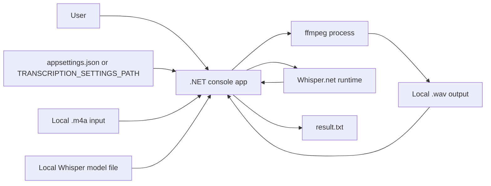
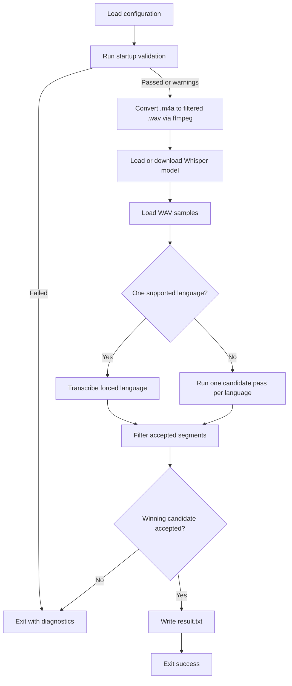
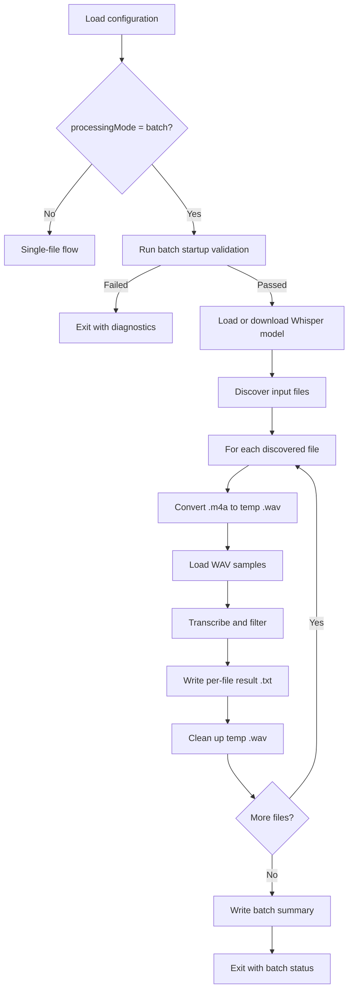
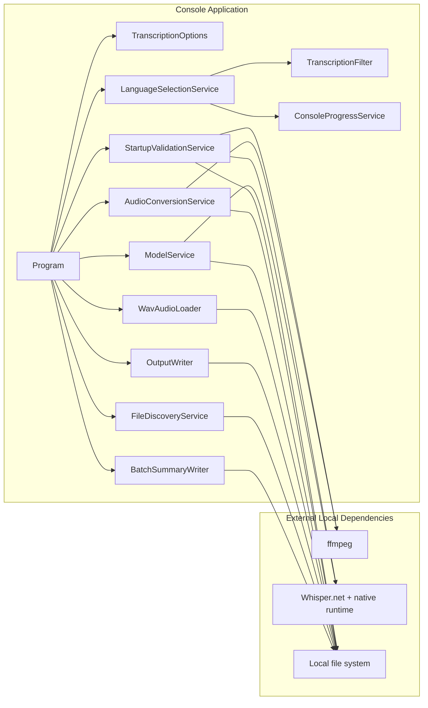

# Architecture

## Purpose

This document describes the high-level architecture for the Audio Transcription Utility defined in [PRD.md](PRD.md). It focuses on:

- system boundaries
- runtime flow
- major component responsibilities
- architecture decision records (ADRs)

The design is driven by these PRD constraints:

- local-only transcription
- stable file-based input/output contract
- configuration-driven behavior
- fail-fast startup validation
- visible runtime progress
- graceful cancellation
- reduced hallucinated output
- maintainable and testable structure

## System Context

## High-Level Architecture

The application is a single-process `.NET 9` console app that orchestrates a staged transcription pipeline. It uses local files for all inputs, intermediate artifacts, models, and outputs. External dependencies are limited to:

- `ffmpeg` for audio conversion and filtering
- `Whisper.net` and the local Whisper runtime for inference

The runtime is organized into responsibility-based modules:

- `Program.cs`
  Orchestrates the end-to-end workflow and top-level error handling. Supports both single-file and batch execution paths.
- `Configuration/`
  Loads and validates immutable runtime options from JSON and environment override, including batch configuration.
- `Services/StartupValidationService.cs`
  Runs preflight checks and produces a summarized startup report. Includes batch-specific checks when batch mode is active.
- `Audio/AudioConversionService.cs`
  Invokes `ffmpeg` to convert `.m4a` to filtered mono `16000 Hz` WAV.
- `Services/ModelService.cs`
  Reuses, validates, downloads, or re-downloads the configured Whisper model.
- `Audio/WavAudioLoader.cs`
  Loads WAV bytes and converts them into normalized float samples.
- `Services/LanguageSelectionService.cs`
  Runs single-language transcription or multi-language candidate selection.
- `Processing/TranscriptionFilter.cs`
  Removes unusable, low-confidence, and hallucinated segments.
- `Services/ConsoleProgressService.cs`
  Renders progress in interactive and redirected console modes. Supports batch-level context overlay.
- `Services/OutputWriter.cs`
  Writes accepted transcript segments using the stable timestamped output format.
- `Services/FileDiscoveryService.cs`
  Discovers and validates input files for batch processing.
- `Services/BatchSummaryWriter.cs`
  Generates human-readable batch summary reports with per-file results.

## Runtime Flow

### Single-File Mode

### Batch Mode

## Component View

## Data And Control Boundaries

- Input boundary
  Single-file mode uses a local `.m4a` file plus local configuration. Batch mode uses a directory of `.m4a` files.
- Processing boundary
  Audio conversion is delegated to `ffmpeg`; inference is delegated to local Whisper runtime bindings.
- Intermediate artifact boundary
  The generated `.wav` file is an explicit intermediate output and a stable handoff between conversion and inference. In batch mode, each file gets its own temp WAV.
- Output boundary
  Single-file mode produces `result.txt`. Batch mode produces one `.txt` per input file plus a batch summary report.
- Control boundary
  `Program` remains the sole top-level orchestrator; lower-level modules do not own application flow. In batch mode, `Program` drives the file loop and error isolation.

## Key Quality Attributes

- Privacy
  Audio and transcript data stay local.
- Reliability
  Preflight validation prevents long-running work when prerequisites are invalid.
- Maintainability
  Responsibilities are split by module instead of embedding all business rules in the entry point.
- Testability
  Filtering, config validation, WAV loading, startup reporting, and output formatting are isolated for unit tests; process-level startup behavior is covered by end-to-end tests.
- Operability
  The app emits progress, diagnostics, candidate scores, skipped-segment reasons, and explicit failure messages.

## ADRs

### ADR-001: Use a local-only console architecture

- Status: Accepted
- Context: The PRD explicitly prohibits cloud transcription APIs and UI expansion beyond a console app.
- Decision: Keep the product as a local `.NET` console application that reads and writes local files only.
- Consequences:
  - Preserves privacy and offline operation.
  - Keeps deployment simple.
  - Excludes web, desktop, and SaaS architecture concerns from the current scope.

### ADR-002: Keep the external contract file-based and backward-compatible

- Status: Accepted
- Context: The PRD requires stable input, intermediate, and output artifacts.
- Decision: Retain the file contract of `.m4a` input, `.wav` intermediate output, and `result.txt` final output.
- Consequences:
  - The pipeline stays easy to automate and inspect.
  - Intermediate WAV files remain debuggable.
  - Future changes must preserve the output line format.

### ADR-003: Make runtime behavior configuration-driven

- Status: Accepted
- Context: Paths, model settings, language behavior, filtering thresholds, startup validation, and progress settings must be adjustable without code edits.
- Decision: Load all runtime behavior from `appsettings.json` or `TRANSCRIPTION_SETTINGS_PATH`, then normalize into immutable runtime options.
- Consequences:
  - Business rules stay out of the orchestration path.
  - Environments can vary without recompilation.
  - Invalid settings fail early during startup.

### ADR-004: Use `ffmpeg` as an external audio-preprocessing stage

- Status: Accepted
- Context: The PRD requires `.m4a` to `.wav` conversion, mono `16000 Hz` output, and a configurable audio-filter chain.
- Decision: Delegate conversion and filtering to `ffmpeg` rather than implementing codec and DSP logic inside the app.
- Consequences:
  - The application remains smaller and easier to maintain.
  - Filter behavior maps directly from configuration to process arguments.
  - Runtime correctness depends on `ffmpeg` availability, so startup validation must check it.

### ADR-005: Manage Whisper models locally with reuse-first behavior

- Status: Accepted
- Context: The product must use a local Whisper model and recover from missing or unloadable model files.
- Decision: Attempt to reuse the configured model first, then download or re-download only when necessary.
- Consequences:
  - Repeat runs avoid unnecessary downloads.
  - Corrupt or empty model files do not silently proceed.
  - Model management stays deterministic and local.

### ADR-006: Use staged transcription with explicit post-processing filters

- Status: Accepted
- Context: The PRD requires anti-hallucination decoder settings and transcript filtering for silence, noise markers, placeholders, and repeated loops.
- Decision: Separate inference from transcript acceptance. Raw Whisper segments are produced first, then filtered through deterministic post-processing rules.
- Consequences:
  - Decoder tuning and transcript filtering can evolve independently.
  - Diagnostic logging can explain why segments were skipped.
  - Final output quality improves without changing the external output contract.

### ADR-007: Optimize language handling for the configured language set

- Status: Accepted
- Context: Single-language runs should not pay the cost of multi-language comparison, while multi-language runs must choose the best supported candidate.
- Decision:
  - If one language is configured, force that language directly.
  - If multiple languages are configured, run one pass per language and select the winner using duration-weighted segment probability with configurable ambiguity handling.
- Consequences:
  - Single-language runs are simpler and faster.
  - Multi-language selection is explicit and auditable.
  - Ambiguous results can be rejected or allowed with warning based on configuration.

### ADR-008: Fail fast before expensive work starts

- Status: Accepted
- Context: Conversion, model download, and transcription are long-running operations with multiple prerequisites.
- Decision: Run a configurable startup validation stage before beginning expensive processing.
- Consequences:
  - Users see actionable diagnostics earlier.
  - The app avoids partial work when dependencies are missing.
  - Startup checks become part of the architecture rather than an optional afterthought.

### ADR-009: Propagate cancellation through the full pipeline

- Status: Accepted
- Context: The PRD requires clean cancellation across download, conversion, transcription, and output writing.
- Decision: Use a single run-scoped `CancellationToken`, wire it through async operations, and kill child `ffmpeg` work if cancellation is requested.
- Consequences:
  - Long-running operations stop promptly.
  - Cancellation behavior is consistent across stages.
  - External process cleanup remains an explicit responsibility of the host app.

### ADR-010: Reuse the Whisper processing runtime within a run

- Status: Accepted
- Context: The current implementation notes native teardown instability on macOS after multi-language passes.
- Decision: Keep the Whisper factory alive for the process lifetime and reuse a single processor across candidate passes in one run.
- Consequences:
  - The design favors runtime stability over aggressive resource teardown.
  - Multi-language processing remains inside one controlled inference session.
  - Native lifecycle concerns are isolated behind the transcription services.

### ADR-011: Sequential batch file processing

- Status: Accepted
- Context: Whisper inference is CPU/GPU-intensive. Parallel processing would require careful memory management and native runtime coordination.
- Decision: Process files sequentially in a single thread. The Whisper factory and model are shared across files.
- Consequences:
  - Simpler implementation with predictable memory usage.
  - No native runtime contention.
  - Throughput scales linearly with file count.

### ADR-012: Configuration-driven batch mode

- Status: Accepted
- Context: The application is fully configuration-driven (ADR-003). Batch mode should follow the same pattern rather than introducing CLI arguments.
- Decision: Add a `processingMode` field and a `batch` section inside the `transcription` configuration. When `processingMode` is `"batch"`, the application discovers files from `batch.inputDirectory` instead of using the single `inputFilePath`. Single-file paths are optional in batch mode.
- Consequences:
  - No CLI contract changes.
  - The user's intent (single vs. batch) is explicit and unambiguous.
  - Backward-compatible: when `processingMode` is `"single"` or absent, the application behaves exactly as before.

### ADR-013: One result file per input file in batch mode

- Status: Accepted
- Context: The current output contract is one `result.txt` per run. For batch mode, combining all results would lose file boundaries.
- Decision: Each input file produces its own result file in `batch.outputDirectory`, named `{inputFileNameWithoutExtension}.txt`.
- Consequences:
  - Existing output format is preserved per file.
  - Results are independently usable.
  - The single-file `resultFilePath` setting is ignored when batch mode is active.

### ADR-014: Continue-on-error with batch summary

- Status: Accepted
- Context: A batch of many files should not abort entirely because one file has a corrupt header.
- Decision: By default, record the error and continue to the next file. Configurable via `batch.stopOnFirstError`.
- Consequences:
  - Users get maximum output from a batch run.
  - The summary report clearly shows which files succeeded, failed, or were skipped.

### ADR-015: Intermediate WAV files use a temp directory in batch mode

- Status: Accepted
- Context: In single-file mode, `wavFilePath` is a fixed configured path. In batch mode, each file needs its own WAV.
- Decision: Generate intermediate WAV files in `batch.tempDirectory` (defaults to system temp). Clean up after each file completes unless `batch.keepIntermediateFiles` is `true`.
- Consequences:
  - Disk usage stays bounded.
  - Debugging is possible by enabling `keepIntermediateFiles`.

## Testing Alignment

The architecture supports the PRD testing strategy:

- unit tests cover configuration loading, startup validation reporting, WAV loading, filtering, language decision rules, output formatting, batch configuration validation, file discovery, and batch summary formatting
- end-to-end tests validate startup failure, successful entry into the transcription flow, batch mode disabled behavior, batch processing of multiple files, and batch error handling
- test support utilities use temporary settings, generated WAV fixtures, and fake `ffmpeg` executables to keep tests local and deterministic

## Future Evolution

The current architecture leaves room for future extension without breaking the contract:

- additional supported languages through configuration
- alternate local Whisper model sizes
- richer diagnostics and reporting
- internal refactoring toward interfaces if the application grows beyond the current static-service layout
- parallel batch processing with concurrency limits
- recursive subdirectory scanning for batch input
- structured output formats (JSON, CSV) for batch results

Any future change should preserve the PRD non-goals unless the product scope changes explicitly.
