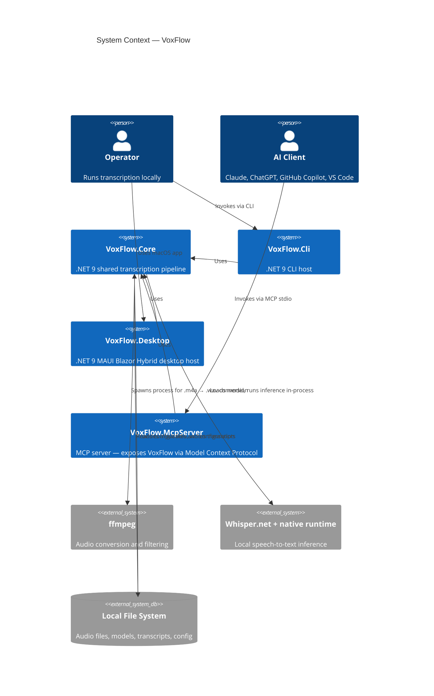
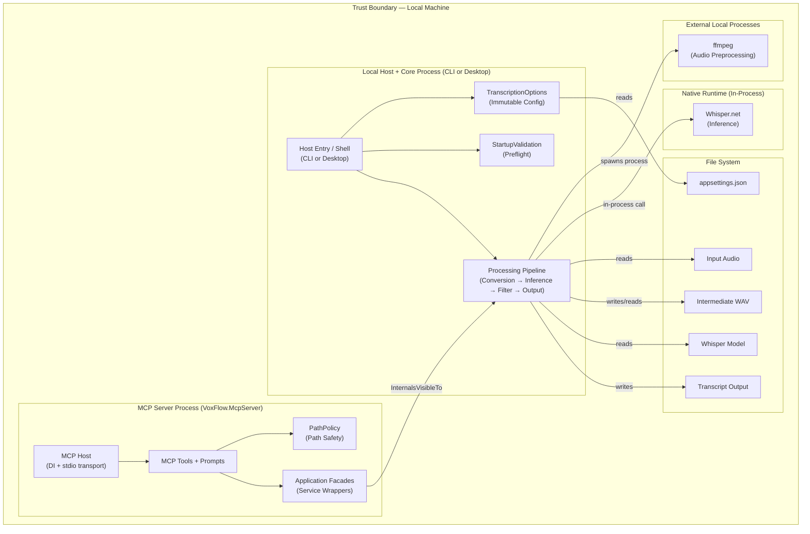

# Architecture

## Overview

VoxFlow is a fully local, privacy-first audio transcription system. The shared core is a .NET 9 library that orchestrates a staged pipeline: configuration loading, preflight validation, audio preprocessing via ffmpeg, Whisper inference via local model, post-processing filters, and file output.

Three hosts use that shared core today:

- `VoxFlow.Cli` for command-line runs
- `VoxFlow.Desktop` for the macOS MAUI Blazor Hybrid workflow
- `VoxFlow.McpServer` for MCP stdio integration with AI clients

`VoxFlow.McpServer` exposes the transcription pipeline to AI clients (Claude, ChatGPT, GitHub Copilot, VS Code) via the Model Context Protocol over stdio transport.

This document provides the architectural overview. Detailed views are in [`docs/architecture/`](docs/architecture/).

| View | Document | Purpose |
|------|----------|---------|
| System Context | [01-system-context.md](docs/architecture/01-system-context.md) | External actors, boundaries, trust zones |
| Container View | [02-container-view.md](docs/architecture/02-container-view.md) | Process boundary and internal module layout |
| Component View | [03-component-view.md](docs/architecture/03-component-view.md) | Detailed component responsibilities and dependencies |
| Runtime Sequences | [04-runtime-sequences.md](docs/architecture/04-runtime-sequences.md) | Single-file and batch processing sequences |
| Quality Attributes | [05-quality-attributes.md](docs/architecture/05-quality-attributes.md) | Privacy, reliability, testability, operability analysis |
| Decision Log | [06-decision-log.md](docs/architecture/06-decision-log.md) | ADRs with alternatives considered and trade-offs |
| Architecture Review | [07-architecture-review.md](docs/architecture/07-architecture-review.md) | Summary assessment of the current design |
| Testing Strategy | [08-testing-strategy.md](docs/architecture/08-testing-strategy.md) | Test pyramid, infrastructure, and coverage layers |
| Frontend Architecture | [09-frontend-architecture.md](docs/architecture/09-frontend-architecture.md) | Desktop Blazor Hybrid UI structure and state management |
| Performance & Scalability | [10-performance-scalability.md](docs/architecture/10-performance-scalability.md) | Resource management, scaling characteristics, trade-offs |
| Risks & Open Questions | [11-risks-assumptions.md](docs/architecture/11-risks-assumptions.md) | Assumptions, risks, and unresolved design questions |

## Design Principles

1. **Local-only processing.** Audio never leaves the machine. No network calls during transcription.
2. **Explicit boundaries.** Each pipeline stage has a clear input contract, output contract, and failure mode.
3. **Fail fast.** Preflight validation catches missing dependencies before expensive work begins.
4. **Configuration over code.** All runtime behavior is driven by `appsettings.json` with environment variable override.
5. **Deliberate simplicity.** A single-process architecture is the right level of complexity for this problem. Abstractions exist only where they earn their cost.

## System Context



## High-Level Pipeline

The processing pipeline is a linear chain of stages. Each stage either succeeds (passing its output to the next stage) or fails fast with diagnostics.

```
 Configuration → Validation → Conversion → Model Load → Audio Load → Inference → Filtering → Output
      ↑               ↑            ↑                                      ↑           ↑
 appsettings.json  ffmpeg check   ffmpeg                              Whisper.net  Threshold config
                   model check    .m4a → .wav                                      Noise markers
                   path checks                                                     Loop detection
```

In batch mode, the pipeline after model loading repeats per file, with error isolation and a summary report at the end.

## Project Responsibilities

| Project | Folder | Responsibility |
|--------|--------|----------------|
| `VoxFlow.Core` | `src/VoxFlow.Core/` | Shared configuration loading, startup validation, single-file transcription, batch orchestration, model management, filtering, and file output |
| `VoxFlow.Cli` | `src/VoxFlow.Cli/` | Console host, Ctrl+C cancellation, console progress, structured progress output for Desktop bridge, and CLI-oriented exit codes |
| `VoxFlow.Desktop` | `src/VoxFlow.Desktop/` | MAUI Blazor Hybrid shell, Desktop configuration merge, native file picker / drag-and-drop adapters, result actions (clipboard, Finder), crash diagnostics, and contextual UI flow |
| `VoxFlow.McpServer` | `src/VoxFlow.McpServer/` | Stdio MCP host, path safety policy, 7 MCP tools (including configuration inspection), 4 prompts |
| `tests/*` | `tests/` | Unit, regression, end-to-end, and headless Desktop UI/component tests |

## Key Architectural Decisions

The full decision log is in [06-decision-log.md](docs/architecture/06-decision-log.md). The most significant decisions:

| # | Decision | Rationale |
|---|----------|-----------|
| ADR-001 | Local-only console architecture | Privacy requirement; no network = no data exposure risk |
| ADR-004 | ffmpeg as external preprocessing | Avoids embedding codec/DSP logic; ffmpeg is battle-tested |
| ADR-006 | Staged inference + post-processing | Separates ML concerns from filtering rules; each can evolve independently |
| ADR-008 | Fail fast before expensive work | Startup validation prevents wasted compute on invalid configurations |
| ADR-011 | Sequential batch processing | Predictable memory; no native runtime contention; appropriate for local tool |
| ADR-014 | Continue-on-error in batch | One bad file should not discard work done on other files |
| ADR-016 | MCP server as separate host with InternalsVisibleTo | Pragmatic integration; avoids restructuring CLI for DI |
| ADR-017 | Stdio-only MCP transport | Local-first security; no network surface area |
| ADR-018 | Path policy for MCP tool arguments | Prevents directory traversal from AI client inputs |
| ADR-021 | Blazor Hybrid for macOS desktop UI | Reuse .NET + web component model inside a native shell |
| ADR-022 | Contextual Desktop flow | Keep Desktop UI state aligned with the visible screen and ViewModel state |

## Boundary Map



Everything stays within the local machine trust boundary. There is no network boundary to cross. The MCP server adds a path safety boundary (`PathPolicy`) between AI client inputs and the file system.

## Testing Strategy

The architecture supports testability through module isolation:

- **Unit tests** cover configuration validation, startup reporting, WAV parsing, transcript filtering, language selection logic, output formatting, file discovery, and batch summary generation.
- **End-to-end tests** validate full application startup, transcription flow entry, batch processing, and error handling using generated WAV fixtures and fake ffmpeg executables.
- **MCP server tests** cover path policy validation, MCP configuration binding, Core model integration, and tool behavior (transcript reading with real file I/O).
- **Desktop component tests** cover headless Razor rendering for `Routes`, `MainLayout`, `ReadyView`, `RunningView`, `CompleteView`, `FailedView`, `DropZone`, status/progress/result states, start-guard validation, transient-state clearing, cancellation cleanup, warning handling, progress accessibility, human-readable stage labels, full-transcript copy, preview truncation, action error handling, and real-audio browse integration at the `ReadyView` level.
- **Desktop real UI automation** covers app launch, browse-file happy path, transcript copy, failure recovery, and repeated sequential processing against the actual `.app` bundle. The automation bridge (`DesktopUiAutomationHost`) uses file-based IPC with the WKWebView to drive DOM interactions from out-of-process test code.
- **Test support utilities** (`tests/TestSupport/`) provide deterministic test infrastructure: temporary directories, generated settings files, WAV fixtures, and mock ffmpeg.

All tests run locally without network access, consistent with the local-only architecture.

Current verification status:

- Core and CLI processing are verified against `artifacts/Input/Test 1.m4a` and `artifacts/Input/Test 2.m4a`.
- The Desktop `ReadyView -> DropZone -> AppViewModel -> VoxFlow.Core` path passes with real audio.
- The fully integrated `Routes`-based Desktop shell is stable: all headless and real UI tests pass.

## Related Documents

- [PRD.md](docs/product/PRD.md) — Product requirements and non-goals
- [ROADMAP.md](docs/product/ROADMAP.md) — MCP server integration roadmap
- [SETUP.md](SETUP.md) — Environment setup and operations guide
