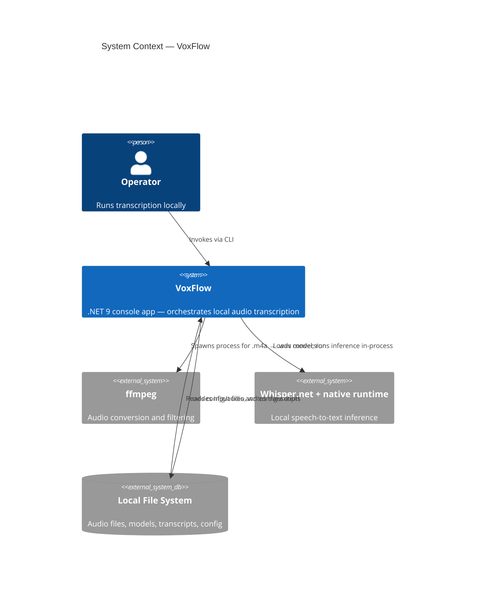
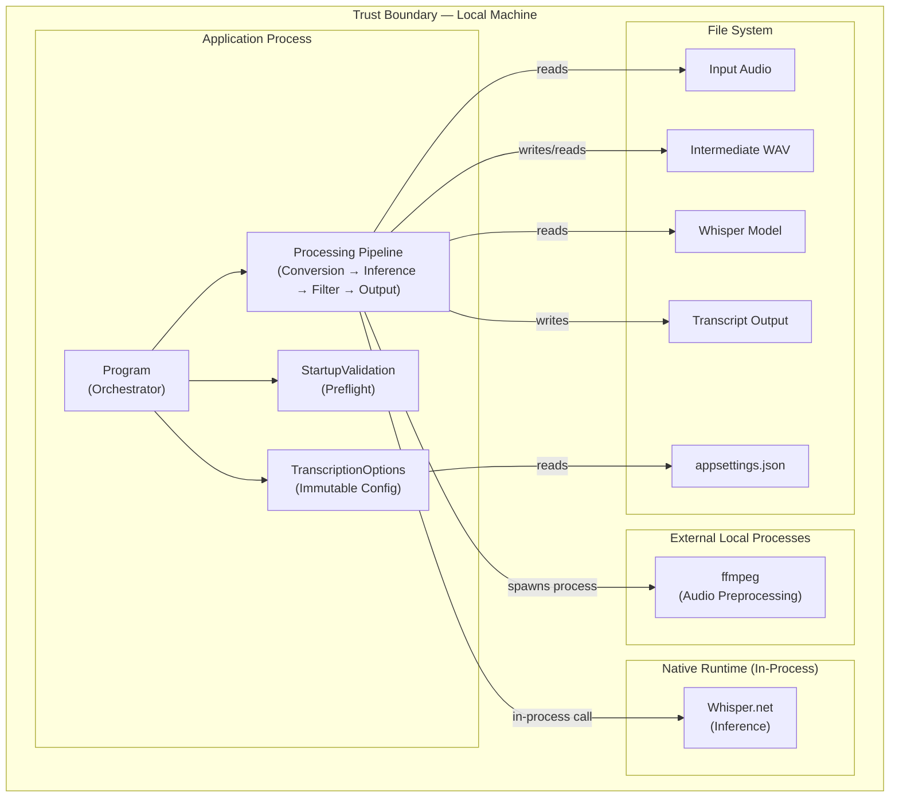

# Architecture

## Overview

VoxFlow is a single-process .NET 9 console application for fully local, privacy-first audio transcription. It orchestrates a staged pipeline: configuration loading, preflight validation, audio preprocessing via ffmpeg, Whisper inference via local model, post-processing filters, and file output.

This document provides the architectural overview. Detailed views are in [`docs/architecture/`](docs/architecture/).

| View | Document | Purpose |
|------|----------|---------|
| System Context | [01-system-context.md](docs/architecture/01-system-context.md) | External actors, boundaries, trust zones |
| Container View | [02-container-view.md](docs/architecture/02-container-view.md) | Process boundary and internal module layout |
| Component View | [03-component-view.md](docs/architecture/03-component-view.md) | Detailed component responsibilities and dependencies |
| Runtime Sequences | [04-runtime-sequences.md](docs/architecture/04-runtime-sequences.md) | Single-file and batch processing sequences |
| Quality Attributes | [05-quality-attributes.md](docs/architecture/05-quality-attributes.md) | Privacy, reliability, testability, operability analysis |
| Decision Log | [06-decision-log.md](docs/architecture/06-decision-log.md) | ADRs with alternatives considered and trade-offs |
| Architecture Review | [07-architecture-review.md](docs/architecture/07-architecture-review.md) | Summary assessment of the current design |

## Design Principles

1. **Local-only processing.** Audio never leaves the machine. No network calls during transcription.
2. **Explicit boundaries.** Each pipeline stage has a clear input contract, output contract, and failure mode.
3. **Fail fast.** Preflight validation catches missing dependencies before expensive work begins.
4. **Configuration over code.** All runtime behavior is driven by `appsettings.json` with environment variable override.
5. **Deliberate simplicity.** A single-process architecture is the right level of complexity for this problem. Abstractions exist only where they earn their cost.

## System Context



## High-Level Pipeline

The processing pipeline is a linear chain of stages. Each stage either succeeds (passing its output to the next stage) or fails fast with diagnostics.

```
 Configuration → Validation → Conversion → Model Load → Audio Load → Inference → Filtering → Output
      ↑               ↑            ↑                                      ↑           ↑
 appsettings.json  ffmpeg check   ffmpeg                              Whisper.net  Threshold config
                   model check    .m4a → .wav                                      Noise markers
                   path checks                                                     Loop detection
```

In batch mode, the pipeline after model loading repeats per file, with error isolation and a summary report at the end.

## Module Responsibilities

| Module | Folder | Responsibility |
|--------|--------|----------------|
| Program | root | Top-level orchestrator, cancellation, exit codes |
| TranscriptionOptions | Configuration/ | Immutable runtime options from JSON |
| StartupValidationService | Services/ | Preflight checks with pass/warn/fail/skip status |
| AudioConversionService | Audio/ | ffmpeg invocation for .m4a → .wav |
| WavAudioLoader | Audio/ | WAV parsing into normalized float samples |
| ModelService | Services/ | Whisper model loading with reuse-first behavior |
| LanguageSelectionService | Services/ | Single/multi-language transcription and scoring |
| TranscriptionFilter | Processing/ | Segment filtering: hallucinations, noise, loops |
| ConsoleProgressService | Services/ | ANSI progress bar with batch context |
| OutputWriter | Services/ | Timestamped transcript file writing |
| FileDiscoveryService | Services/ | Batch input file discovery and path mapping |
| BatchSummaryWriter | Services/ | Per-file result summary for batch runs |

## Key Architectural Decisions

The full decision log is in [06-decision-log.md](docs/architecture/06-decision-log.md). The most significant decisions:

| # | Decision | Rationale |
|---|----------|-----------|
| ADR-001 | Local-only console architecture | Privacy requirement; no network = no data exposure risk |
| ADR-004 | ffmpeg as external preprocessing | Avoids embedding codec/DSP logic; ffmpeg is battle-tested |
| ADR-006 | Staged inference + post-processing | Separates ML concerns from filtering rules; each can evolve independently |
| ADR-008 | Fail fast before expensive work | Startup validation prevents wasted compute on invalid configurations |
| ADR-011 | Sequential batch processing | Predictable memory; no native runtime contention; appropriate for local tool |
| ADR-014 | Continue-on-error in batch | One bad file should not discard work done on other files |

## Boundary Map



Everything stays within the local machine trust boundary. There is no network boundary to cross.

## Testing Strategy

The architecture supports testability through module isolation:

- **Unit tests** cover configuration validation, startup reporting, WAV parsing, transcript filtering, language selection logic, output formatting, file discovery, and batch summary generation.
- **End-to-end tests** validate full application startup, transcription flow entry, batch processing, and error handling using generated WAV fixtures and fake ffmpeg executables.
- **Test support utilities** (`tests/TestSupport/`) provide deterministic test infrastructure: temporary directories, generated settings files, WAV fixtures, and mock ffmpeg.

All tests run locally without network access, consistent with the local-only architecture.

## Related Documents

- [PRD.md](docs/product/PRD.md) — Product requirements and non-goals
- [ROADMAP.md](docs/product/ROADMAP.md) — MCP server integration roadmap
- [SETUP.md](SETUP.md) — Environment setup and operations guide
