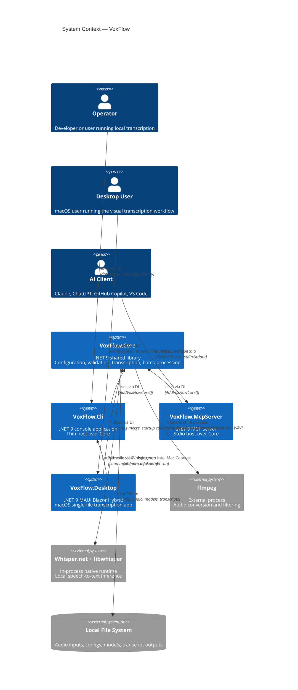

# System Context View

> C4 Level 1 — How VoxFlow fits into its environment.

## Context Diagram



## Actors and External Systems

| Actor / System | Type | Interaction | Trust Level |
|---------------|------|-------------|-------------|
| Operator | Human | Configures settings, invokes CLI, reads outputs | Full trust (local user) |
| Desktop User | Human | Selects files, reviews results, retries failures in the macOS app | Full trust (local user) |
| AI Client | Software | Discovers and invokes MCP tools over stdio | Semi-trusted (path policy enforced) |
| ffmpeg | External process | Spawned for audio conversion; killed on cancellation | Trusted (system-installed binary) |
| Whisper.net + libwhisper | Native runtime | Loaded by Core during local inference | Trusted (vendored runtime) |
| Local File System | Storage | All config, model, temp, and transcript I/O | Trusted (local disk) |
| VoxFlow.Core | .NET 9 shared library | Shared pipeline used by all hosts | Trusted (same codebase) |
| VoxFlow.Cli | .NET 9 console process | Direct local CLI host over Core | Trusted (same codebase) |
| VoxFlow.McpServer | .NET 9 console process | MCP host over Core with path policy | Trusted (same codebase) |
| VoxFlow.Desktop | .NET 9 MAUI process | Visual host over Core; may spawn CLI locally on Intel Mac Catalyst | Trusted (same codebase) |

## Trust Boundaries

There is still exactly one operational trust boundary: the local machine.

All three product surfaces run locally. The application does not call remote inference services. Model download is the only network-touching behavior, and it writes a local model file that is validated before use.

The MCP server adds a semi-trusted boundary between AI clients and the local file system. Paths from MCP tool calls must pass `PathPolicy` before any file access occurs.

The Desktop host can spawn `VoxFlow.Cli` on Intel Mac Catalyst, but that bridge remains inside the same local-machine boundary. It is an internal compatibility path, not a remote service.

```text
┌──────────────────────────────────────────────────────────────────────┐
│                           Local Machine                              │
│                                                                      │
│  ┌────────────────────────────────────────────────────────────────┐  │
│  │                     VoxFlow.Core (.NET 9)                      │  │
│  │  Configuration -> Validation -> Conversion -> Inference ->     │  │
│  │  Filtering -> Output                                            │  │
│  └────────────────────────────────────────────────────────────────┘  │
│        ↑ (DI)                  ↑ (DI)                ↑ (DI)          │
│  ┌──────────────┐      ┌─────────────────┐    ┌──────────────────┐   │
│  │ VoxFlow.Cli  │      │ VoxFlow.McpServer│    │ VoxFlow.Desktop  │   │
│  │ local host   │      │ stdio MCP host   │    │ MAUI Blazor UI   │   │
│  └──────────────┘      └─────────────────┘    └──────────────────┘   │
│         ↑                                               │             │
│         └──────────── Intel Mac Catalyst bridge ────────┘             │
│                                                                      │
│     ┌─────────┐            ┌────────────────────┐    ┌───────────┐   │
│     │ ffmpeg  │            │ Whisper.net runtime │    │ File System│   │
│     └─────────┘            └────────────────────┘    └───────────┘   │
│                                                                      │
└──────────────────────────────────────────────────────────────────────┘
                     │
                     │ one-time model download only
                     ▼
                ┌──────────┐
                │ Internet │
                └──────────┘
```

## Data Flow Summary

| Data | Source | Destination | Format | Notes |
|------|--------|-------------|--------|-------|
| Configuration | JSON files / env var | `TranscriptionOptions` | JSON | Core hosts load from `appsettings.json` or `TRANSCRIPTION_SETTINGS_PATH` |
| Input audio | Local file(s) | `AudioConversionService` | Binary | Single-file or batch |
| Intermediate audio | `ffmpeg` output | `WavAudioLoader` | PCM WAV | Cleaned up unless configured otherwise |
| Whisper model | Local `.bin` file | `ModelService` / `WhisperFactory` | GGML binary | Reused across runs when valid |
| Raw segments | Whisper inference | `TranscriptionFilter` | In-memory segment data | Includes timestamps and probabilities |
| Filtered segments | `TranscriptionFilter` | `OutputWriter` | In-memory accepted segments | Only accepted transcript content is written |
| Transcript | `OutputWriter` | Local `.txt` file | UTF-8 text | `{start}->{end}: {text}` |
| Batch summary | `BatchSummaryWriter` | Local `.txt` file | UTF-8 text | Per-file batch report |

## Data Flow Summary (MCP Server)

| Data | Source | Destination | Format | Notes |
|------|--------|-------------|--------|-------|
| MCP tool invocation | AI Client | `VoxFlow.McpServer` | JSON-RPC | Tool name + arguments |
| MCP tool result | `VoxFlow.McpServer` | AI Client | JSON-RPC | Structured result or error |
| Diagnostic logs | MCP host | stderr | Text | stdout stays reserved for MCP frames |
| Path validation | MCP tool args | `PathPolicy` | Strings | Checked against allowed roots before file access |

## Data Flow Summary (Desktop App)

| Data | Source | Destination | Format | Notes |
|------|--------|-------------|--------|-------|
| Desktop config | Bundled config + user overrides | `DesktopConfigurationService` | JSON | Merged before startup and before CLI-bridge runs |
| File selection | User | `VoxFlow.Desktop` | File path | Native picker or drag-and-drop |
| Validation report | `IValidationService` | `AppViewModel` / `ReadyView` | In-memory | Blocking failures disable file selection and show a warning banner |
| Progress updates | Core or CLI bridge | `AppViewModel` | `ProgressUpdate` | Rendered in `RunningView` |
| Transcription result | Core or CLI bridge | `CompleteView` / `FailedView` | In-memory + transcript file | Intel bridge reads transcript preview back from disk |

## What Is Deliberately Excluded

The system context has no:

- **Cloud inference services** — transcription stays local-only.
- **Database** — file system persistence is sufficient for this tool.
- **HTTP/SSE MCP transport** — MCP remains stdio-only to keep the local security model simple.
