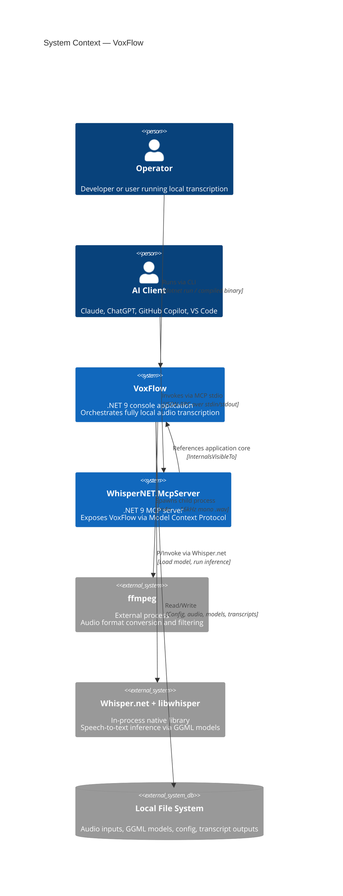

# System Context View

> C4 Level 1 — How VoxFlow fits into its environment.

## Context Diagram



## Actors and External Systems

| Actor / System | Type | Interaction | Trust Level |
|---------------|------|-------------|-------------|
| Operator | Human | Configures `appsettings.json`, invokes CLI, reads output | Full trust (local user) |
| AI Client | Software | Discovers and invokes tools via MCP stdio protocol | Semi-trusted (path policy enforced) |
| ffmpeg | External process | Spawned for audio conversion; killed on cancellation | Trusted (system-installed binary) |
| Whisper.net + libwhisper | In-process native library | Loaded once per run; model loaded from local file | Trusted (vendored native runtime) |
| Local File System | Storage | All I/O: config, input audio, intermediate WAV, models, transcripts | Trusted (local disk) |
| WhisperNET.McpServer | .NET 9 console process | Separate MCP host referencing VoxFlow core via InternalsVisibleTo | Trusted (same codebase) |

## Trust Boundaries

There is exactly one trust boundary: **the local machine**.

All actors and systems operate within this boundary. The application makes no network calls during transcription. Model download (a one-time operation) is the only network-touching behavior, and it writes to a local file that is validated before use.

The MCP server introduces a **semi-trusted boundary** between AI clients and the application core. File paths provided by AI clients are validated by `PathPolicy` against configurable allowed input/output root directories before any file system access occurs.

```
┌─────────────────────────────────────────────────────────────┐
│                     Local Machine                           │
│                                                             │
│  ┌──────────────────────────────────────────────────────┐   │
│  │              Application Process (VoxFlow CLI)       │   │
│  │  Configuration → Validation → Pipeline → Output      │   │
│  │                                    ↕                  │   │
│  │                              Whisper.net              │   │
│  └──────────────────────────────────────────────────────┘   │
│                                                             │
│  ┌──────────────────────────────────────────────────────┐   │
│  │        MCP Server Process (WhisperNET.McpServer)     │   │
│  │  PathPolicy → Facades → VoxFlow Application Core     │   │
│  │       ↕ (stdio: stdin/stdout = MCP frames)           │   │
│  │       AI Client (Claude, ChatGPT, VS Code, etc.)     │   │
│  └──────────────────────────────────────────────────────┘   │
│           ↕                        ↕                        │
│      ┌─────────┐          ┌──────────────┐                  │
│      │ ffmpeg  │          │  File System  │                  │
│      └─────────┘          └──────────────┘                  │
│                                                             │
└─────────────────────────────────────────────────────────────┘
               │
               │ (one-time model download only)
               ↓
        ┌──────────────┐
        │   Internet   │
        └──────────────┘
```

## Data Flow Summary

| Data | Source | Destination | Format | Notes |
|------|--------|-------------|--------|-------|
| Configuration | `appsettings.json` / env var | TranscriptionOptions | JSON | Loaded once at startup, immutable after |
| Input audio | Local `.m4a` file(s) | AudioConversionService | Binary | Single file or batch directory |
| Intermediate audio | ffmpeg output | WavAudioLoader | PCM WAV (16kHz, mono) | Deleted after processing unless configured otherwise |
| Whisper model | Local `.bin` file | ModelService → WhisperFactory | GGML binary | Reused across files in batch mode |
| Raw segments | Whisper inference | TranscriptionFilter | In-memory SegmentData | Timestamped text with probability scores |
| Filtered segments | TranscriptionFilter | OutputWriter | In-memory FilteredSegment | Accepted segments only |
| Transcript | OutputWriter | Local `.txt` file | UTF-8 text | `{start}->{end}: {text}` per line |
| Batch summary | BatchSummaryWriter | Local `.txt` file | UTF-8 text | Per-file status report |

## Data Flow Summary (MCP Server)

| Data | Source | Destination | Format | Notes |
|------|--------|-------------|--------|-------|
| MCP tool invocation | AI Client (stdin) | WhisperNET.McpServer | JSON-RPC | Tool name + arguments |
| MCP tool result | WhisperNET.McpServer (stdout) | AI Client | JSON-RPC | Structured JSON response |
| Diagnostic logs | WhisperNET.McpServer | stderr | Text | Console.SetOut(Console.Error) protects stdout |
| Path validation | MCP tool arguments | PathPolicy | String | Validated against allowed roots before file access |

## What Is Deliberately Excluded

The system context has no:

- **Network services** — No REST APIs, no message queues, no cloud storage. This is a design choice, not a limitation.
- **Database** — File system is the only persistence layer. For a local transcription tool, this is the right abstraction.
- **HTTP/SSE MCP transport** — The MCP server uses stdio only. HTTP transport would introduce network surface area that conflicts with the local-only principle.
