# Container View

> C4 Level 2 — Deployable containers and their primary boundaries.

## Why Four Containers

In C4 terminology, a container is a separately deployable or runnable unit. VoxFlow currently has four:

1. **VoxFlow.Core** — shared .NET 9 class library containing configuration, validation, transcription, batch processing, output writing, and DI registration
2. **VoxFlow.Cli** — thin console host over Core
3. **VoxFlow.McpServer** — stdio MCP host over Core with path-policy enforcement
4. **VoxFlow.Desktop** — macOS MAUI Blazor Hybrid host for the single-file visual workflow

All three hosts register the same shared Core services through `AddVoxFlowCore()`. The Desktop host also adds host-only services for configuration merging and, on Intel Mac Catalyst, a local CLI bridge that swaps in a Desktop-specific `ITranscriptionService` implementation.

## Container Diagram

```mermaid
flowchart TB
    subgraph core_lib["VoxFlow.Core (shared library)"]
        direction TB

        subgraph core_interfaces["Service Interfaces"]
            ifaces["ITranscriptionService<br/>IValidationService<br/>IConfigurationService<br/>IBatchTranscriptionService<br/>ITranscriptReader"]
        end

        subgraph config_layer["Configuration Layer"]
            options["TranscriptionOptions<br/><i>Immutable runtime config</i>"]
        end

        subgraph validation_layer["Validation Layer"]
            validation["ValidationService<br/><i>Preflight checks with<br/>pass/warn/fail/skip</i>"]
        end

        subgraph processing["Processing Layer"]
            convert["AudioConversionService<br/><i>ffmpeg process management</i>"]
            loader["WavAudioLoader<br/><i>PCM parsing + normalization</i>"]
            model["ModelService<br/><i>Model loading + download</i>"]
            lang["LanguageSelectionService<br/><i>Inference + candidate scoring</i>"]
            filter["TranscriptionFilter<br/><i>Segment acceptance rules</i>"]
        end

        subgraph output_layer["Output Layer"]
            writer["OutputWriter<br/><i>Timestamped transcript files</i>"]
            discovery["FileDiscoveryService<br/><i>Batch file enumeration</i>"]
            summary["BatchSummaryWriter<br/><i>Batch result reports</i>"]
        end

        subgraph di_reg["DI Registration"]
            addcore["AddVoxFlowCore()<br/><i>Single registration entry point</i>"]
        end
    end

    subgraph cli_container["VoxFlow.Cli Process (.NET 9)"]
        direction TB
        cli_program["Program.cs<br/><i>Entry point, flow control,<br/>cancellation, exit codes</i>"]
        cli_progress["CliProgressHandler<br/><i>Console progress rendering</i>"]
    end

    subgraph mcp_container["VoxFlow.McpServer Process (.NET 9)"]
        direction TB
        mcp_program["Program.cs<br/><i>DI composition root,<br/>stdio transport setup</i>"]
        tools["WhisperMcpTools / Prompts / Resources"]
        pathpolicy["PathPolicy<br/><i>Input/output root enforcement</i>"]
        mcp_options["McpOptions"]
    end

    subgraph desktop_container["VoxFlow.Desktop Process (.NET 9 MAUI Blazor Hybrid)"]
        direction TB
        routes["Routes.razor<br/><i>Startup init + retry surface</i>"]
        layout["MainLayout.razor<br/><i>State-based shell</i>"]
        desktop_vm["AppViewModel<br/><i>Ready / Running / Failed / Complete</i>"]
        desktop_config["DesktopConfigurationService<br/><i>Merged config snapshots</i>"]
        desktop_bridge["DesktopCliTranscriptionService<br/><i>Intel-only CLI bridge</i>"]
        desktop_views["ReadyView / RunningView / FailedView / CompleteView / DropZone"]
    end

    subgraph external["External Dependencies"]
        ffmpeg["ffmpeg process"]
        whisper["Whisper.net<br/>+ libwhisper native"]
        fs["Local File System"]
    end

    subgraph clients["AI Clients"]
        ai["Claude / ChatGPT /<br/>GitHub Copilot / VS Code"]
    end

    cli_program -->|DI| addcore
    mcp_program -->|DI| addcore
    desktop_vm -->|DI| addcore
    routes --> desktop_vm
    layout --> desktop_views
    desktop_views --> desktop_vm

    cli_program --> cli_progress
    ai -->|stdio MCP| mcp_program
    mcp_program --> mcp_options
    tools --> pathpolicy
    tools --> ifaces

    desktop_vm --> ifaces
    desktop_vm --> desktop_bridge
    desktop_vm --> desktop_config
    desktop_bridge --> desktop_config
    desktop_bridge -->|launches locally on Intel| cli_program
    routes --> layout

    ifaces --> validation
    ifaces --> convert
    ifaces --> model
    ifaces --> lang
    ifaces --> writer
    ifaces --> discovery
    ifaces --> summary
    lang --> filter

    validation -.-> ffmpeg
    validation -.-> whisper
    convert -.->|spawns| ffmpeg
    model -.-> whisper
    lang -.-> whisper

    options -.-> fs
    desktop_config -.-> fs
    convert -.-> fs
    loader -.-> fs
    model -.-> fs
    writer -.-> fs
    discovery -.-> fs
    summary -.-> fs
```



## Module Boundary Rules

| Rule | Enforcement |
|------|-------------|
| **Host projects delegate business logic to Core interfaces.** Host code is limited to UI, process control, transport, path policy, or host-specific configuration handling. | By convention; visible in project references and host code |
| **All Core registration goes through `AddVoxFlowCore()`.** Hosts must not hand-wire Core internals. | By convention; single DI entry point |
| **Configuration is immutable after load.** `TranscriptionOptions` is a sealed runtime snapshot. | Compiler-enforced |
| **Core external process execution is confined to `AudioConversionService`.** Desktop host code may additionally spawn a local CLI helper on Intel Mac Catalyst. | By convention |
| **Native Whisper runtime calls stay inside Core services.** Hosts never call Whisper APIs directly. | By convention |
| **Core file writes are confined to `OutputWriter`, `BatchSummaryWriter`, and `ModelService`.** Desktop host code may also write merged temp config snapshots and user override files. | By convention |
| **Progress reporting uses `IProgress<ProgressUpdate>`.** Core has no dependency on console, Blazor, or MCP output mechanisms. | Compiler-enforced by project boundaries |

## Shared Core with Dependency Injection

With three hosts sharing one pipeline, `VoxFlow.Core` is the right home for all transcription business logic. `AddVoxFlowCore()` registers the shared service set used by CLI, MCP, and Desktop.

Desktop adds two host-only layers on top:

- `DesktopConfigurationService`, which merges bundled defaults, user overrides, and optional override files into a temporary config snapshot
- `DesktopCliTranscriptionService`, which replaces the default `ITranscriptionService` on Intel Mac Catalyst and launches `VoxFlow.Cli` locally

That keeps the compatibility workaround in the Desktop host instead of leaking platform-specific branching into Core.

## Layer Interactions

```text
Host (CLI / MCP / Desktop)
    |
    +-- AddVoxFlowCore()          registers shared Core services
    |
    +-- Host-specific layer
    |      CLI: progress + exit codes
    |      MCP: stdio transport + path policy
    |      Desktop: config merge + UI state + optional CLI bridge
    |
    +-- Core interfaces           host calls service contracts via DI
           |
           +-- Configuration      load immutable runtime options
           +-- Validation         run startup checks
           +-- Processing         convert -> load model -> infer -> filter
           +-- Output             write transcript or batch summary
           +-- Progress           report via IProgress<ProgressUpdate>
```

## Container-Specific Notes

- **CLI** is the canonical terminal host. It exercises the shared pipeline directly and is also reused by Desktop as a local helper on Intel Mac Catalyst.
- **MCP Server** is intentionally thin: it validates paths, delegates to Core, and keeps stdout clean for protocol traffic.
- **Desktop** is a single-file user workflow today. Batch processing exists in Core but is not exposed in the UI.
- **Desktop on Intel** is no longer a pure in-process container at transcription time. It remains a local-only system, but the Desktop process launches the CLI container to keep Whisper execution on the known-good path for that platform.
