# Container View

> C4 Level 2 — The single-process container and its internal module boundaries.

## Why "Container" for a Console App

In C4 terminology, a container is a separately deployable/runnable unit. VoxFlow is a single container — one .NET 9 console process. There is no multi-container deployment. This is deliberate: a local transcription tool does not benefit from process separation, message passing, or distributed coordination.

The value of the container view here is showing the **internal module boundaries** within that single process.

## Container Diagram

```mermaid
flowchart TB
    subgraph container["VoxFlow Process (.NET 9)"]
        direction TB

        subgraph orchestration["Orchestration Layer"]
            program["Program.cs<br/><i>Entry point, flow control,<br/>cancellation, exit codes</i>"]
        end

        subgraph config_layer["Configuration Layer"]
            options["TranscriptionOptions<br/><i>Immutable runtime config<br/>from JSON + env override</i>"]
        end

        subgraph validation_layer["Validation Layer"]
            startup["StartupValidationService<br/><i>Preflight checks with<br/>pass/warn/fail/skip</i>"]
        end

        subgraph processing["Processing Layer"]
            convert["AudioConversionService<br/><i>ffmpeg process management</i>"]
            loader["WavAudioLoader<br/><i>PCM parsing + normalization</i>"]
            model["ModelService<br/><i>Model loading + download</i>"]
            lang["LanguageSelectionService<br/><i>Inference + candidate scoring</i>"]
            filter["TranscriptionFilter<br/><i>Segment acceptance rules</i>"]
        end

        subgraph output_layer["Output Layer"]
            writer["OutputWriter<br/><i>Timestamped transcript files</i>"]
            discovery["FileDiscoveryService<br/><i>Batch file enumeration</i>"]
            summary["BatchSummaryWriter<br/><i>Batch result reports</i>"]
        end

        subgraph presentation["Presentation Layer"]
            progress["ConsoleProgressService<br/><i>ANSI progress bar + spinner</i>"]
        end
    end

    subgraph external["External Dependencies"]
        ffmpeg["ffmpeg process"]
        whisper["Whisper.net<br/>+ libwhisper native"]
        fs["Local File System"]
    end

    program --> options
    program --> startup
    program --> convert
    program --> model
    program --> loader
    program --> lang
    program --> writer
    program --> discovery
    program --> summary
    lang --> filter
    lang --> progress

    convert -.->|spawns| ffmpeg
    model -.->|P/Invoke| whisper
    lang -.->|P/Invoke| whisper
    startup -.->|probes| ffmpeg
    startup -.->|probes| whisper

    options -.->|reads| fs
    convert -.->|reads/writes| fs
    loader -.->|reads| fs
    model -.->|reads/writes| fs
    writer -.->|writes| fs
    discovery -.->|reads| fs
    summary -.->|writes| fs
```



## Module Boundary Rules

The internal structure follows these conventions:

| Rule | Enforcement |
|------|-------------|
| **Program is the only orchestrator.** No module initiates application flow or calls other modules laterally (except LanguageSelectionService → TranscriptionFilter, which is a direct pipeline dependency). | By convention; visible in dependency graph |
| **Configuration is immutable after load.** TranscriptionOptions is sealed with read-only properties. No module modifies configuration at runtime. | Compiler-enforced (sealed class, init-only properties) |
| **External process calls are confined to AudioConversionService.** Only one module spawns child processes. | By convention |
| **Native runtime calls are confined to ModelService and LanguageSelectionService.** Whisper.net is used through WhisperFactory, not directly by other modules. | By convention |
| **File system writes are confined to OutputWriter, BatchSummaryWriter, and ModelService.** Other modules read but do not write files. | By convention |

## Why Static Services

All services are static classes rather than instance types behind interfaces. This is a deliberate trade-off:

**The case for static services:**
- The application has exactly one execution path — there is no polymorphism needed at runtime.
- Constructor injection adds ceremony without benefit when there is no composition root or container.
- Static methods make dependencies explicit at the call site rather than hiding them behind interface abstractions.
- Test coverage is achieved through integration tests, test fixtures, and module boundaries — not mocks.

**The cost accepted:**
- Harder to unit test in isolation (some modules depend on file system or ffmpeg availability).
- If the application grows significantly (e.g., MCP server integration), this would likely evolve toward interfaces and DI. The [ROADMAP](../product/ROADMAP.md) already identifies this as a future refactoring step.

**Why the cost is acceptable now:**
- The test suite already achieves meaningful coverage through generated fixtures and fake ffmpeg.
- The application is small enough that the dependency graph is fully visible in `Program.cs`.
- Premature abstraction would obscure the simplicity of the actual flow.

## Layer Interactions

```
  Orchestration    reads config, delegates to all layers below
       │
       ├── Configuration    loaded once, passed as parameter
       │
       ├── Validation       runs before processing, reads config
       │
       ├── Processing       sequential stages, each stage independent
       │       │
       │       └── filter is called by language service (not orchestrator)
       │
       ├── Output           writes results after processing completes
       │
       └── Presentation     called by language service during inference
```

The orchestration layer (`Program.cs`) drives control flow. Processing layer modules do not call each other except for the LanguageSelectionService → TranscriptionFilter dependency, which represents a direct pipeline stage relationship (inference produces segments, filter accepts/rejects them).
