# Container View

> C4 Level 2 — The single-process container and its internal module boundaries.

## Why Two Containers

In C4 terminology, a container is a separately deployable/runnable unit. VoxFlow now has two containers:

1. **VoxFlow CLI** — the original console application, invoked directly by operators
2. **WhisperNET.McpServer** — a separate .NET 9 console process that exposes VoxFlow's capabilities via the Model Context Protocol (MCP) over stdio transport

The MCP server references VoxFlow's application core via `InternalsVisibleTo` and uses application facades to bridge between MCP tool invocations and the existing static services. This avoids restructuring the original codebase while providing a DI-friendly host for the MCP SDK.

## Container Diagram

```mermaid
flowchart TB
    subgraph container["VoxFlow Process (.NET 9)"]
        direction TB

        subgraph orchestration["Orchestration Layer"]
            program["Program.cs<br/><i>Entry point, flow control,<br/>cancellation, exit codes</i>"]
        end

        subgraph config_layer["Configuration Layer"]
            options["TranscriptionOptions<br/><i>Immutable runtime config<br/>from JSON + env override</i>"]
        end

        subgraph validation_layer["Validation Layer"]
            startup["StartupValidationService<br/><i>Preflight checks with<br/>pass/warn/fail/skip</i>"]
        end

        subgraph processing["Processing Layer"]
            convert["AudioConversionService<br/><i>ffmpeg process management</i>"]
            loader["WavAudioLoader<br/><i>PCM parsing + normalization</i>"]
            model["ModelService<br/><i>Model loading + download</i>"]
            lang["LanguageSelectionService<br/><i>Inference + candidate scoring</i>"]
            filter["TranscriptionFilter<br/><i>Segment acceptance rules</i>"]
        end

        subgraph facade_layer["Application Facade Layer"]
            facades["IStartupValidationFacade<br/>ITranscriptionFacade<br/>IModelInspectionFacade<br/>ILanguageInfoFacade<br/>ITranscriptReaderFacade<br/><i>Instance-based wrappers around static services</i>"]
        end

        subgraph output_layer["Output Layer"]
            writer["OutputWriter<br/><i>Timestamped transcript files</i>"]
            discovery["FileDiscoveryService<br/><i>Batch file enumeration</i>"]
            summary["BatchSummaryWriter<br/><i>Batch result reports</i>"]
        end

        subgraph presentation["Presentation Layer"]
            progress["ConsoleProgressService<br/><i>ANSI progress bar + spinner</i>"]
        end
    end

    subgraph mcp_container["WhisperNET.McpServer Process (.NET 9)"]
        direction TB

        subgraph mcp_host["MCP Host Layer"]
            mcp_program["Program.cs<br/><i>DI composition root,<br/>stdio transport setup</i>"]
        end

        subgraph mcp_tools["MCP Tool Layer"]
            tools["WhisperMcpTools<br/><i>6 MCP tools</i>"]
            resources["WhisperMcpResourceTools<br/><i>Configuration inspector</i>"]
            prompts["WhisperMcpPrompts<br/><i>4 guided workflows</i>"]
        end

        subgraph mcp_security["Security Layer"]
            pathpolicy["PathPolicy<br/><i>Input/output root enforcement</i>"]
        end

        subgraph mcp_config["Configuration"]
            mcp_options["McpOptions<br/><i>Server identity, path policy,<br/>batch limits, logging</i>"]
        end
    end

    subgraph external["External Dependencies"]
        ffmpeg["ffmpeg process"]
        whisper["Whisper.net<br/>+ libwhisper native"]
        fs["Local File System"]
    end

    subgraph clients["AI Clients"]
        ai["Claude / ChatGPT /<br/>GitHub Copilot / VS Code"]
    end

    program --> options
    program --> startup
    program --> convert
    program --> model
    program --> loader
    program --> lang
    program --> writer
    program --> discovery
    program --> summary
    lang --> filter
    lang --> progress

    ai -->|stdio MCP| mcp_program
    mcp_program --> mcp_options
    tools --> pathpolicy
    tools --> facades
    facades --> startup
    facades --> convert
    facades --> model
    facades --> lang
    facades --> writer

    convert -.->|spawns| ffmpeg
    model -.->|P/Invoke| whisper
    lang -.->|P/Invoke| whisper
    startup -.->|probes| ffmpeg
    startup -.->|probes| whisper

    options -.->|reads| fs
    convert -.->|reads/writes| fs
    loader -.->|reads| fs
    model -.->|reads/writes| fs
    writer -.->|writes| fs
    discovery -.->|reads| fs
    summary -.->|writes| fs
```



## Module Boundary Rules

The internal structure follows these conventions:

| Rule | Enforcement |
|------|-------------|
| **Program is the only orchestrator.** No module initiates application flow or calls other modules laterally (except LanguageSelectionService → TranscriptionFilter, which is a direct pipeline dependency). | By convention; visible in dependency graph |
| **Configuration is immutable after load.** TranscriptionOptions is sealed with read-only properties. No module modifies configuration at runtime. | Compiler-enforced (sealed class, init-only properties) |
| **External process calls are confined to AudioConversionService.** Only one module spawns child processes. | By convention |
| **Native runtime calls are confined to ModelService and LanguageSelectionService.** Whisper.net is used through WhisperFactory, not directly by other modules. | By convention |
| **File system writes are confined to OutputWriter, BatchSummaryWriter, and ModelService.** Other modules read but do not write files. | By convention |

## Why Static Services (VoxFlow CLI)

The VoxFlow CLI retains static services. This remains appropriate for the CLI host:

**The case for static services:**
- The CLI has exactly one execution path — there is no polymorphism needed at runtime.
- Constructor injection adds ceremony without benefit when there is no composition root or container.
- Static methods make dependencies explicit at the call site rather than hiding them behind interface abstractions.
- Test coverage is achieved through integration tests, test fixtures, and module boundaries — not mocks.

## Application Facades (MCP Server Bridge)

The MCP server needs DI-compatible services for the MCP SDK's constructor injection. Rather than restructuring the VoxFlow core, **application facades** bridge the gap:

- Each facade implements an interface (e.g., `ITranscriptionFacade`) and wraps the existing static services
- Facades are registered as singletons in the MCP server's DI container
- This `InternalsVisibleTo` + facade approach is the pragmatic first step documented in the [ROADMAP](../product/ROADMAP.md)
- A future evolution toward a shared application core with extracted interfaces remains possible without breaking the existing CLI host

**Why facades instead of full refactoring:**
- The CLI host continues to work unchanged — no regression risk
- The MCP server gets testable, DI-friendly service contracts
- The application layer contracts (DTOs) are host-agnostic, so both hosts can evolve independently

## Layer Interactions

```
  Orchestration    reads config, delegates to all layers below
       │
       ├── Configuration    loaded once, passed as parameter
       │
       ├── Validation       runs before processing, reads config
       │
       ├── Processing       sequential stages, each stage independent
       │       │
       │       └── filter is called by language service (not orchestrator)
       │
       ├── Output           writes results after processing completes
       │
       └── Presentation     called by language service during inference
```

The orchestration layer (`Program.cs`) drives control flow. Processing layer modules do not call each other except for the LanguageSelectionService → TranscriptionFilter dependency, which represents a direct pipeline stage relationship (inference produces segments, filter accepts/rejects them).
