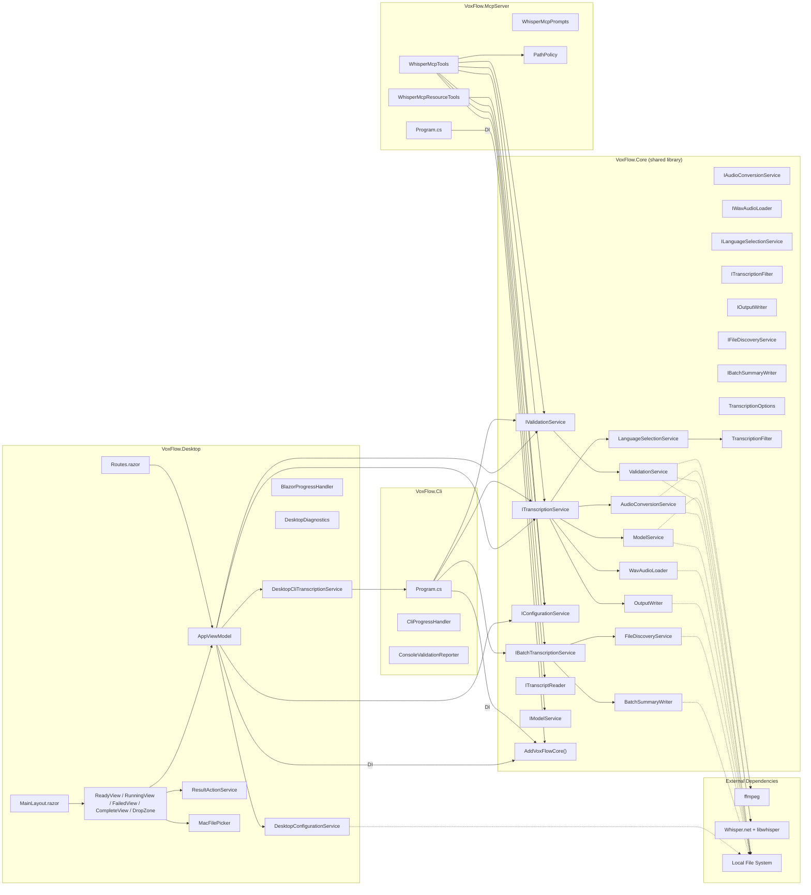

# Component View

> C4 Level 3 — Detailed component responsibilities, interfaces, and data types.

## Component Diagram



## Component Details

### Core Service Interfaces

**File:** `VoxFlow.Core/Interfaces/`

**Responsibility:** Define the contracts that all host projects use to access transcription functionality via dependency injection.

| Interface | Responsibility |
|-----------|---------------|
| `ITranscriptionService` | Orchestrate single-file transcription pipeline (convert, model, load, infer, filter, write) |
| `IBatchTranscriptionService` | Orchestrate batch file processing with error isolation and summary |
| `IValidationService` | Run preflight checks and return structured validation reports |
| `IConfigurationService` | Load and provide immutable runtime configuration; expose supported language list |
| `ITranscriptReader` | Read previously produced transcript files |
| `IAudioConversionService` | Convert input audio to WAV via ffmpeg; validate ffmpeg availability |
| `IModelService` | Load Whisper models with reuse-first behavior; provide model inspection |
| `IWavAudioLoader` | Parse WAV files into normalized float sample arrays for Whisper inference |
| `ILanguageSelectionService` | Run Whisper inference per configured language and select the best candidate |
| `ITranscriptionFilter` | Apply configurable post-processing rules to accept or reject raw Whisper segments |
| `IOutputWriter` | Write accepted transcript segments to a UTF-8 text file |
| `IFileDiscoveryService` | Discover and enumerate input files for batch processing |
| `IBatchSummaryWriter` | Generate human-readable batch processing summary reports |

All 13 interfaces are registered through `AddVoxFlowCore()`. Hosts consume them via constructor injection.

---

### AddVoxFlowCore (DI Registration)

**File:** `VoxFlow.Core/DependencyInjection/ServiceCollectionExtensions.cs`

**Responsibility:** Single entry point for registering all Core services in any host's DI container.

**Key behaviors:**
- Registers all 13 service interfaces with their concrete implementations as singletons
- Called by CLI, MCP Server, and Desktop as the shared DI baseline
- Desktop then overrides `IConfigurationService` with `DesktopConfigurationService` and conditionally replaces `ITranscriptionService` with `DesktopCliTranscriptionService` on Intel Mac Catalyst

---

### Program — CLI Host (Orchestrator)

**File:** `VoxFlow.Cli/Program.cs`

**Responsibility:** Thin CLI entry point. Sets up DI via `AddVoxFlowCore()`, manages cancellation (Ctrl+C → CancellationTokenSource), and maps outcomes to exit codes.

**Key behaviors:**
- Registers Core services with `ValidateOnBuild` and `ValidateScopes` enabled
- Delegates to `ITranscriptionService` for single-file mode or `IBatchTranscriptionService` for batch mode based on `options.IsBatchMode`
- Provides `CliProgressHandler` as the `IProgress<ProgressUpdate>` implementation
- Renders startup validation report via `ConsoleValidationReporter`

**Exit codes:** 0 (success), 1 (failure or cancellation)

---

### TranscriptionOptions (Configuration)

**File:** `VoxFlow.Core/Configuration/TranscriptionOptions.cs`

**Responsibility:** Load, validate, and normalize all runtime settings into a sealed immutable object.

**Key behaviors:**
- Loads from `appsettings.json` or path specified by `TRANSCRIPTION_SETTINGS_PATH` environment variable
- Validates numeric ranges, probabilities, language codes, and path existence
- Exposes 45+ properties covering all runtime behavior
- Provides `GetSupportedLanguageSummary()` for human-readable language display

**Design note:** The class is sealed with read-only properties. Once loaded, configuration cannot be modified. This eliminates an entire class of bugs where runtime behavior changes unexpectedly.

**Related types:**
- `SupportedLanguage` (record) — language code, display name, and priority
- Internal JSON deserialization classes for the appsettings schema

---

### ValidationService (Preflight Checks)

**File:** `VoxFlow.Core/Services/ValidationService.cs`

**Responsibility:** Run configurable preflight checks and produce a structured validation report.

**Checks performed (configurable by `startupValidation`):**

| Check | Mode | What it validates |
|-------|------|-------------------|
| Settings file | Both | Resolved configuration path |
| Input file | Single | Input .m4a exists |
| Output directory | Single | Output directory exists and is writable |
| ffmpeg availability | Both | `ffmpeg -version` succeeds |
| Model type | Both | Configured model type is a valid GGML type |
| Model directory | Both | Model directory exists and is writable |
| Model file state | Both | Existing model can be reused, or a download is needed |
| Whisper runtime | Both | Native library loads successfully |
| Language support | Both | Configured languages are valid Whisper language codes |
| Batch input directory | Batch | Input directory exists |
| Batch output directory | Batch | Output directory exists and is writable |
| Batch temp directory | Batch | Temp directory exists and is writable |
| Batch file pattern | Batch | Pattern is non-empty |

**Related types:**
- `ValidationResult` (record) — aggregated check results with overall outcome
- `ValidationCheck` (record) — name, status, details
- `ValidationCheckStatus` (enum) — Passed, Warning, Failed, Skipped
- `ConsoleValidationReporter` (static class in `VoxFlow.Cli`) — ANSI-colored console output for CLI

---

### AudioConversionService (Audio Preprocessing)

**File:** `VoxFlow.Core/Services/AudioConversionService.cs`

**Responsibility:** Invoke ffmpeg to convert input audio to filtered mono 16kHz WAV.

**Key behaviors:**
- Validates input file existence before conversion
- Validates ffmpeg availability (separate from startup validation — can be called independently)
- Builds ffmpeg command line from configuration (audio filters, codec settings)
- Manages ffmpeg child process lifecycle including cancellation (kills process on token cancellation)

**Design note:** Within `VoxFlow.Core`, this is the only module that spawns external processes. Desktop host code may additionally launch the local CLI bridge on Intel Mac Catalyst.

---

### WavAudioLoader (Audio Parsing)

**File:** `VoxFlow.Core/Services/WavAudioLoader.cs`

**Responsibility:** Parse WAV files into normalized float sample arrays suitable for Whisper inference.

**Key behaviors:**
- Validates RIFF/WAVE header structure
- Supports multiple PCM bit depths: 8-bit, 16-bit, 24-bit, 32-bit
- Supports IEEE float format
- Normalizes all formats to float32 in [-1.0, 1.0] range
- Chunk-based parsing (navigates fmt and data chunks)

**Design note:** This module handles the impedance mismatch between ffmpeg's WAV output and Whisper.net's expected input format. It is tested with generated WAV fixtures covering each supported bit depth.

---

### ModelService (Model Management)

**File:** `VoxFlow.Core/Services/ModelService.cs`

**Responsibility:** Load Whisper GGML models with reuse-first behavior.

**Key behaviors:**
- Attempts to reuse existing model file first
- Downloads model only when file is missing, empty, or corrupt
- Uses atomic file operations (write to temp, then move) to prevent corrupt partial downloads
- Returns a `WhisperFactory` ready for processor creation
- Provides `InspectModel()` for read-only model metadata (consumed by MCP `inspect_model` tool)

**Reuse-first strategy:**
```
Model file exists and loads? → Reuse
Model file exists but fails? → Re-download
Model file missing?          → Download
```

---

### LanguageSelectionService (Inference + Scoring)

**File:** `VoxFlow.Core/Services/LanguageSelectionService.cs`

**Responsibility:** Run Whisper inference for configured languages and select the best candidate.

**Single-language flow:**
- Forces the configured language directly — no comparison needed

**Multi-language flow:**
- Runs one inference pass per configured language
- Scores each candidate using duration-weighted segment probability
- Selects winner with configurable ambiguity handling (reject or warn)

**Scoring formula:** Each segment's probability is weighted by its duration relative to total audio duration. This prevents a single long low-confidence segment from dominating the score.

**Related types:**
- `LanguageSelectionResult` (public record) — winning language, score, audio duration, accepted/skipped segments, optional warning
- `LanguageSelectionDecision` (internal record) — winning candidate + optional warning
- `CandidateResult` (internal record) — language, segments, score for one candidate pass

---

### TranscriptionFilter (Post-Processing)

**File:** `VoxFlow.Core/Services/TranscriptionFilter.cs`

**Responsibility:** Accept or reject raw Whisper segments based on configurable rules.

**Filtering stages (applied in order):**

| Stage | What it catches |
|-------|----------------|
| Empty text | Blank segments |
| Non-speech markers | Configurable list (e.g., `[BLANK_AUDIO]`, `(silence)`) |
| Bracketed placeholders | Stage directions like `[music]`, `[applause]` |
| Low probability | Below configurable threshold |
| Low-information long segments | Long duration + low average probability |
| Suspicious non-speech | Text with no letters or digits (punctuation-only) |
| Repetitive loops | Short phrases repeated multiple times (hallucination pattern) |

**Design note:** Each filter stage returns a specific `SegmentSkipReason`, enabling diagnostic logging that explains exactly why a segment was rejected. This is critical for debugging Whisper hallucination behavior.

**Related types:**
- `CandidateFilteringResult` (record) — accepted + skipped segments
- `FilteredSegment` (record) — accepted segment with timestamp and text
- `SkippedSegment` (record) — rejected segment with reason
- `SegmentSkipReason` (enum) — Empty, NoiseMarker, BracketedPlaceholder, LowProbability, LowInformationLong, SuspiciousNonSpeech, RepetitiveLoop

---

### CliProgressHandler (Presentation)

**File:** `VoxFlow.Cli/CliProgressHandler.cs`

**Responsibility:** Render real-time progress during transcription.

**Key behaviors:**
- **Interactive mode (default):** Renders a single-line console progress prefix derived from `ProgressStage`, prints percentage completion and current message, writes a final newline on `Complete` or `Failed`
- **Structured mode (`VOXFLOW_PROGRESS_STREAM=1`):** Emits JSON-encoded `CliProgressEnvelope` lines to stderr, prefixed with `VOXFLOW_PROGRESS `. This mode is used by the Desktop CLI bridge to receive progress updates from the child CLI process.
- Stays thin by consuming the host-agnostic `ProgressUpdate` type from Core

---

### OutputWriter (File Output)

**File:** `VoxFlow.Core/Services/OutputWriter.cs`

**Responsibility:** Write accepted transcript segments to a UTF-8 text file.

**Output format:** `{start:TimeSpan}->{end:TimeSpan}: {text}\n`

**Design note:** `BuildOutputText()` is separated from `WriteAsync()` to enable unit testing of output formatting without file I/O.

---

### FileDiscoveryService (Batch Input)

**File:** `VoxFlow.Core/Services/FileDiscoveryService.cs`

**Responsibility:** Discover input files for batch processing.

**Key behaviors:**
- Scans configured input directory with file pattern (e.g., `*.m4a`)
- Computes output path and temp WAV path for each file
- Alphabetical sorting for deterministic processing order
- Filters empty files (marked as Skipped)

**Related types:**
- `DiscoveredFile` (record) — input/output/temp paths, status
- `DiscoveryStatus` (enum) — Ready, Skipped

---

### BatchSummaryWriter (Batch Reporting)

**File:** `VoxFlow.Core/Services/BatchSummaryWriter.cs`

**Responsibility:** Generate a human-readable summary of batch processing results.

**Output includes:** total/succeeded/failed/skipped counts, total duration, and per-file status with error details.

**Related types:**
- `FileProcessingResult` (record) — file path, status, language, duration, error
- `FileProcessingStatus` (enum) — Success, Failed, Skipped

---

## MCP Server Components

> These components live in the `VoxFlow.McpServer` project — a separate .NET 9 console application that injects `VoxFlow.Core` interfaces directly via DI.

### PathPolicy (Security)

**File:** `VoxFlow.McpServer/Security/PathPolicy.cs`

**Responsibility:** Enforce allowed input/output root directories for file paths provided by AI clients.

**Key behaviors:**
- Validates paths are absolute (when `requireAbsolutePaths` is configured)
- Rejects path traversal patterns (`..`, `~`, null bytes)
- Normalizes and checks paths against configured allowed root directories (with trailing-separator enforcement to prevent prefix collisions)
- Provides `SanitizePath()` for safe error messages (shows only filename, never full path)
- Exposes `IsAllowedInputPath()` / `IsAllowedOutputPath()` for non-throwing validation

---

### WhisperMcpTools (MCP Tools)

**File:** `VoxFlow.McpServer/Tools/WhisperMcpTools.cs`

**Responsibility:** Expose VoxFlow transcription capabilities as MCP tools discoverable by AI clients.

**6 tools:** `validate_environment`, `transcribe_file`, `transcribe_batch`, `get_supported_languages`, `inspect_model`, `read_transcript`

**Injected Core dependencies:** `ITranscriptionService`, `IBatchTranscriptionService`, `IValidationService`, `IModelService`, `IConfigurationService`, `ITranscriptReader`, `IPathPolicy`, `IOptions<McpOptions>`

Each tool validates paths via `IPathPolicy`, delegates to the appropriate Core service interface, and returns JSON-serialized results. `transcribe_batch` additionally checks `McpOptions.AllowBatch` and passes `McpOptions.MaxBatchFiles` as a cap.

---

### WhisperMcpPrompts (MCP Prompts)

**File:** `VoxFlow.McpServer/Prompts/WhisperMcpPrompts.cs`

**Responsibility:** Provide guided workflow instructions for AI clients using VoxFlow.

**4 prompts:** `transcribe-local-audio`, `batch-transcribe-folder`, `diagnose-transcription-setup`, `inspect-last-transcript`

Prompts are registered via `[McpServerPromptType]` and `.WithPromptsFromAssembly()` in the MCP host.

---

### WhisperMcpResourceTools (Configuration Inspection Tool)

**File:** `VoxFlow.McpServer/Resources/WhisperMcpResources.cs`

**Responsibility:** Expose read-only VoxFlow configuration as an MCP tool for AI client inspection.

**1 tool:** `get_effective_config` — returns a resolved configuration snapshot as JSON, including model path, sample rate, supported languages, filter thresholds, and startup validation state.

**Important implementation detail:** Despite the class name and file location suggesting "resources," this component is annotated with `[McpServerToolType]` and is registered through `.WithToolsFromAssembly()` — the same mechanism as `WhisperMcpTools`. The MCP host does **not** register any first-class MCP protocol resources via `.WithResourcesFromAssembly()`. The "resource" framing is conceptual only: these are regular MCP tools that happen to return read-only configuration data.

---

### McpOptions (MCP Configuration)

**File:** `VoxFlow.McpServer/Configuration/McpOptions.cs`

**Responsibility:** MCP-specific configuration loaded from the `mcp` section of `appsettings.json`.

**Actively enforced settings:**
- `ServerName` / `ServerVersion` — set on the MCP server info during host startup
- `AllowedInputRoots` / `AllowedOutputRoots` — passed to `PathPolicy` constructor
- `RequireAbsolutePaths` — passed to `PathPolicy` constructor
- `AllowBatch` — checked by `WhisperMcpTools.TranscribeBatchAsync()` before batch execution
- `MaxBatchFiles` — passed to `BatchTranscribeRequest` as the file count cap

**Configuration-only (not enforced at runtime):**
- `Resources.Enabled` / `Resources.ExposeLastRun` — defined in `McpResourceOptions` but not consumed by any runtime code
- `Prompts.Enabled` — defined in `McpPromptOptions` but not consumed by any runtime code
- `Logging.MinimumLevel` / `Logging.WriteToStdErr` / `Logging.WriteToFile` / `Logging.LogFilePath` — defined in `McpLoggingOptions` but not consumed by any runtime code

These unenforced options exist as configuration placeholders for future enablement.

---

## Desktop Components

> These components live in the `VoxFlow.Desktop` project — a .NET 9 MAUI Blazor Hybrid macOS application that uses `VoxFlow.Core` via DI.

### MauiProgram (Composition Root)

**File:** `VoxFlow.Desktop/MauiProgram.cs`

**Responsibility:** Desktop DI composition root that builds on top of `AddVoxFlowCore()`.

**Key registrations beyond Core:**
- `DesktopConfigurationService` as both its concrete type and as the `IConfigurationService` override (replaces the Core `ConfigurationService`)
- `IResultActionService` → `ResultActionService` for clipboard and Finder actions
- `DesktopCliTranscriptionService` as the `ITranscriptionService` override — only when `DesktopCliSupport.ShouldUseCliBridge()` returns true (Intel Mac Catalyst)
- `AppViewModel` as a singleton
- `MainPage` as a singleton

---

### DesktopConfigurationService (Desktop Config Composition)

**File:** `VoxFlow.Desktop/Configuration/DesktopConfigurationService.cs`

**Responsibility:** Build the Desktop runtime configuration from bundled defaults, user overrides, and optional explicit overrides. Implements `IConfigurationService` to replace the Core configuration loader.

**Key behaviors:**
- Merges bundled `appsettings.json` with `~/Library/Application Support/VoxFlow/appsettings.json`
- Normalizes Desktop paths into `~/Library/Application Support/VoxFlow/` and `~/Documents/VoxFlow/`
- Writes temporary merged snapshots for startup and CLI-bridge execution
- Applies Intel bridge compatibility overrides during startup validation only (disables `checkModelLoadability`, `checkWhisperRuntime`, `checkLanguageSupport`)
- Provides `SaveUserOverridesAsync()` for persisting user setting changes
- Expands `~` home directory references in path values

---

### DesktopCliTranscriptionService (Intel Compatibility Bridge)

**File:** `VoxFlow.Desktop/Services/DesktopCliTranscriptionService.cs`

**Responsibility:** Replace the default `ITranscriptionService` on Intel Mac Catalyst and execute transcription through the local CLI host.

**Key behaviors:**
- Writes a merged temporary config and injects the selected input path
- Launches `VoxFlow.Cli` via `dotnet exec` when a bundled or built CLI assembly exists, otherwise falls back to `dotnet run --project`
- Sets `TRANSCRIPTION_SETTINGS_PATH` to the merged config and `VOXFLOW_PROGRESS_STREAM=1` to enable structured progress output
- Parses structured `VOXFLOW_PROGRESS` lines from CLI stderr for Desktop-friendly progress updates
- Parses CLI stdout/stderr for success metadata (`DetectedLanguage`, `AcceptedSegmentCount`) and failure messages
- Reads the resulting transcript file back into the Desktop UI via `ITranscriptReader`
- Kills the child process tree on cancellation

**CLI resolution order:**
1. Bundled assembly at `{baseDir}/cli/VoxFlow.Cli.dll` or MonoBundle equivalent
2. Built assembly at `src/VoxFlow.Cli/bin/{Debug|Release}/net9.0/VoxFlow.Cli.dll`
3. Project fallback via `dotnet run --project src/VoxFlow.Cli/VoxFlow.Cli.csproj`

---

### DesktopCliSupport (Bridge Utilities)

**File:** `VoxFlow.Desktop/Services/DesktopCliSupport.cs`

**Responsibility:** Static utilities for the Intel Mac Catalyst CLI bridge.

**Key behaviors:**
- `ShouldUseCliBridge()` — returns true when `OperatingSystem.IsMacCatalyst()` and `RuntimeInformation.ProcessArchitecture == Architecture.X64`
- `ResolveCliInvocation()` — resolves the CLI assembly or project path
- `TryParseProgressUpdate()` — deserializes structured progress JSON from CLI output
- `ExtractSuccessMetadata()` / `ExtractFailureMessage()` — parses CLI output for result information

---

### AppViewModel (Application State)

**File:** `VoxFlow.Desktop/ViewModels/AppViewModel.cs`

**Responsibility:** Manage Desktop UI state and mediate between Blazor views and the configured transcription implementation.

**Key behaviors:**
- Initializes the app by loading configuration and running startup validation
- Owns the UI state machine: `Ready`, `Running`, `Failed`, `Complete`
- Stores the last selected file for retry
- Builds `BlockingValidationMessage` from failed startup checks and `WarningMessage` from warning checks
- Accepts `ProgressUpdate` events through `BlazorProgressHandler` and exposes them to the UI
- Provides `GetFullTranscript()` which reads the full result file, falling back to `TranscriptPreview`
- Cleans up intermediate WAV files after transcription completes
- Places result files in `~/Documents/VoxFlow/output/{inputName}.txt`

---

### BlazorProgressHandler (Desktop Progress)

**File:** `VoxFlow.Desktop/Services/BlazorProgressHandler.cs`

**Responsibility:** Bridge Core `IProgress<ProgressUpdate>` callbacks to the Blazor UI thread.

**Key behavior:** Dispatches progress updates to `MainThread` and sets `AppViewModel.CurrentProgress`, then calls `NotifyStateChanged()` to trigger Blazor re-rendering.

---

### ResultActionService (Post-Transcription Actions)

**File:** `VoxFlow.Desktop/Services/ResultActionService.cs`

**Responsibility:** Handle post-transcription user actions in the Desktop UI.

**Actions:**
- `CopyTextAsync()` — copies transcript text to the macOS clipboard via `Clipboard.Default`
- `OpenResultFolderAsync()` — opens the result folder in Finder via `/usr/bin/open`

---

### MacFilePicker (Native File Selection)

**File:** `VoxFlow.Desktop/Platform/MacFilePicker.cs`

**Responsibility:** Provide a macOS-native audio file picker for the Desktop UI.

**Key behavior:** Uses MAUI `FilePicker.Default` with `public.audio` UTI filter, invoked on the main thread. Returns the selected file's full path or null.

---

### DesktopDiagnostics (Crash Logging)

**File:** `VoxFlow.Desktop/Services/DesktopDiagnostics.cs`

**Responsibility:** Capture unhandled exceptions to a persistent log file at `~/Library/Application Support/VoxFlow/logs/desktop.log`.

**Key behavior:** Hooks `AppDomain.CurrentDomain.UnhandledException` and `TaskScheduler.UnobservedTaskException` to ensure crash information is not silently lost in the MAUI Blazor Hybrid host.

---

### Blazor Pages (UI Screens)

**Responsibility:** Render the visual transcription workflow as Blazor components within the MAUI native shell.

| Page | Responsibility |
|------|---------------|
| Routes | Startup initialization surface; shows a startup-error retry view when initialization throws |
| ReadyView | Ready screen with validation banner and file selection entry points |
| RunningView | Real-time progress during transcription |
| FailedView | Error message plus retry / choose-different-file actions |
| CompleteView | Transcript preview with open-folder and copy-to-clipboard actions |
| DropZone | Shared browse / drag-and-drop entry surface used by `ReadyView` |

**Design note:** The Desktop shell is state-driven, not route-driven. `Routes.razor` handles startup initialization and retry. Once initialized, `MainLayout.razor` switches between `ReadyView`, `RunningView`, `FailedView`, and `CompleteView` based on `AppViewModel.CurrentState`.

**Current verification status:**

- `tests/VoxFlow.Desktop.Tests` exercises `Routes`, `MainLayout`, `ReadyView`, `RunningView`, `FailedView`, `CompleteView`, `DropZone`, and `AppViewModel` transitions in a headless renderer.
- `tests/VoxFlow.Desktop.UiTests` launches the built `.app`, drives the native Open dialog, and verifies the integrated `Ready -> Running -> Complete` path against the real Desktop shell.
- The current Desktop UI does not expose a settings editor; persistent overrides remain file-based in `~/Library/Application Support/VoxFlow/appsettings.json`.
- On Intel Mac Catalyst, the integrated UI path is exercised through the CLI bridge rather than in-process Whisper runtime loading.
