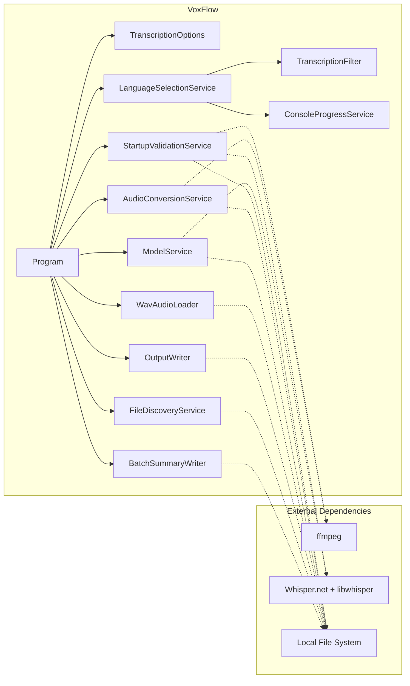

# Component View

> C4 Level 3 — Detailed component responsibilities, interfaces, and data types.

## Component Diagram



## Component Details

### Program (Orchestrator)

**File:** `Program.cs`

**Responsibility:** Top-level orchestration. Selects single-file or batch flow, manages cancellation (Ctrl+C → CancellationTokenSource), and maps outcomes to exit codes.

**Key behaviors:**
- Loads configuration via `TranscriptionOptions.Load()`
- Runs startup validation; exits on failure
- In single-file mode: runs the full pipeline once
- In batch mode: loads model once, then loops over discovered files with error isolation
- Cleans up intermediate WAV files after each file completes

**Exit codes:** 0 (success), 1 (failure), 130 (cancelled)

---

### TranscriptionOptions (Configuration)

**File:** `Configuration/TranscriptionOptions.cs`

**Responsibility:** Load, validate, and normalize all runtime settings into a sealed immutable object.

**Key behaviors:**
- Loads from `appsettings.json` or path specified by `TRANSCRIPTION_SETTINGS_PATH` environment variable
- Validates numeric ranges, probabilities, language codes, and path existence
- Exposes 45+ properties covering all runtime behavior
- Provides `GetSupportedLanguageSummary()` for human-readable language display

**Design note:** The class is sealed with read-only properties. Once loaded, configuration cannot be modified. This eliminates an entire class of bugs where runtime behavior changes unexpectedly.

**Related types:**
- `SupportedLanguage` (record) — language code, display name, and priority
- Internal JSON deserialization classes for the appsettings schema

---

### StartupValidationService (Preflight Checks)

**File:** `Services/StartupValidationService.cs`

**Responsibility:** Run configurable preflight checks and produce a structured validation report.

**Checks performed (15+):**

| Check | Mode | What it validates |
|-------|------|-------------------|
| Settings file | Both | Configuration file exists |
| Input file | Single | Input .m4a exists |
| Output directory | Single | Output directory exists and is writable |
| ffmpeg availability | Both | `ffmpeg -version` succeeds |
| Model type | Both | Configured model type is a valid GGML type |
| Model directory | Both | Model directory exists and is writable |
| Model file | Both | Model file loads without error |
| Whisper runtime | Both | Native library loads successfully |
| Language support | Both | Configured languages are valid Whisper language codes |
| Batch input directory | Batch | Input directory exists |
| Batch output directory | Batch | Output directory exists and is writable |
| Batch temp directory | Batch | Temp directory exists and is writable |
| Batch file pattern | Batch | Pattern is non-empty |

**Related types:**
- `StartupValidationReport` (sealed class) — aggregated check results with overall outcome
- `StartupCheckResult` (record) — name, status, optional message
- `StartupCheckStatus` (enum) — Passed, Warning, Failed, Skipped
- `StartupValidationConsoleReporter` (static class) — ANSI-colored console output

---

### AudioConversionService (Audio Preprocessing)

**File:** `Audio/AudioConversionService.cs`

**Responsibility:** Invoke ffmpeg to convert `.m4a` input to filtered mono 16kHz WAV.

**Key behaviors:**
- Validates input file existence before conversion
- Validates ffmpeg availability (separate from startup validation — can be called independently)
- Builds ffmpeg command line from configuration (audio filters, codec settings)
- Manages ffmpeg child process lifecycle including cancellation (kills process on token cancellation)
- Two overloads: single-file (fixed output path) and batch (per-file temp path)

**Design note:** This is the only module that spawns external processes. Process management complexity is contained here rather than scattered.

**Related types:**
- `ProcessRunResult` (record) — exit code, stdout, stderr from ffmpeg

---

### WavAudioLoader (Audio Parsing)

**File:** `Audio/WavAudioLoader.cs`

**Responsibility:** Parse WAV files into normalized float sample arrays suitable for Whisper inference.

**Key behaviors:**
- Validates RIFF/WAVE header structure
- Supports multiple PCM bit depths: 8-bit, 16-bit, 24-bit, 32-bit
- Supports IEEE float format
- Normalizes all formats to float32 in [-1.0, 1.0] range
- Chunk-based parsing (navigates fmt and data chunks)

**Design note:** This module handles the impedance mismatch between ffmpeg's WAV output and Whisper.net's expected input format. It is tested with generated WAV fixtures covering each supported bit depth.

---

### ModelService (Model Management)

**File:** `Services/ModelService.cs`

**Responsibility:** Load Whisper GGML models with reuse-first behavior.

**Key behaviors:**
- Attempts to reuse existing model file first
- Downloads model only when file is missing, empty, or corrupt
- Uses atomic file operations (write to temp, then move) to prevent corrupt partial downloads
- Returns a `WhisperFactory` ready for processor creation

**Reuse-first strategy:**
```
Model file exists and loads? → Reuse
Model file exists but fails? → Re-download
Model file missing?          → Download
```

---

### LanguageSelectionService (Inference + Scoring)

**File:** `Services/LanguageSelectionService.cs`

**Responsibility:** Run Whisper inference for configured languages and select the best candidate.

**Single-language flow:**
- Forces the configured language directly — no comparison needed

**Multi-language flow:**
- Runs one inference pass per configured language
- Scores each candidate using duration-weighted segment probability
- Selects winner with configurable ambiguity handling (reject or warn)

**Scoring formula:** Each segment's probability is weighted by its duration relative to total audio duration. This prevents a single long low-confidence segment from dominating the score.

**Related types:**
- `CandidateTranscriptionResult` (record) — language, segments, score
- `LanguageSelectionDecision` (record) — winning candidate + optional warning
- `UnsupportedLanguageException` — controlled failure for invalid language codes

---

### TranscriptionFilter (Post-Processing)

**File:** `Processing/TranscriptionFilter.cs`

**Responsibility:** Accept or reject raw Whisper segments based on configurable rules.

**Filtering stages (applied in order):**

| Stage | What it catches |
|-------|----------------|
| Empty text | Blank segments |
| Non-speech markers | Configurable list (e.g., `[BLANK_AUDIO]`, `(silence)`) |
| Bracketed placeholders | Stage directions like `[music]`, `[applause]` |
| Low probability | Below configurable threshold |
| Low-information long segments | Long duration + low average probability |
| Suspicious non-speech | Text with no letters or digits (punctuation-only) |
| Repetitive loops | Short phrases repeated multiple times (hallucination pattern) |

**Design note:** Each filter stage returns a specific `SegmentSkipReason`, enabling diagnostic logging that explains exactly why a segment was rejected. This is critical for debugging Whisper hallucination behavior.

**Related types:**
- `CandidateFilteringResult` (record) — accepted + skipped segments
- `FilteredSegment` (record) — accepted segment with timestamp and text
- `SkippedSegment` (record) — rejected segment with reason
- `SegmentSkipReason` (enum) — Empty, NoiseMarker, BracketedPlaceholder, LowProbability, LowInformationLong, SuspiciousNonSpeech, RepetitiveLoop

---

### ConsoleProgressService (Presentation)

**File:** `Services/ConsoleProgressService.cs`

**Responsibility:** Render real-time progress during transcription.

**Key behaviors:**
- Animated spinner with percentage completion
- Elapsed time tracking
- Batch-level context (`[File X/Y]` prefix)
- Detects interactive vs. redirected console (disables ANSI in pipes)
- Thread-safe rendering via lock

---

### OutputWriter (File Output)

**File:** `Services/OutputWriter.cs`

**Responsibility:** Write accepted transcript segments to a UTF-8 text file.

**Output format:** `{start:TimeSpan}->{end:TimeSpan}: {text}\n`

**Design note:** `BuildOutputText()` is separated from `WriteAsync()` to enable unit testing of output formatting without file I/O.

---

### FileDiscoveryService (Batch Input)

**File:** `Services/FileDiscoveryService.cs`

**Responsibility:** Discover input files for batch processing.

**Key behaviors:**
- Scans configured input directory with file pattern (e.g., `*.m4a`)
- Computes output path and temp WAV path for each file
- Alphabetical sorting for deterministic processing order
- Filters empty files (marked as Skipped)

**Related types:**
- `DiscoveredFile` (record) — input/output/temp paths, status
- `DiscoveryStatus` (enum) — Ready, Skipped

---

### BatchSummaryWriter (Batch Reporting)

**File:** `Services/BatchSummaryWriter.cs`

**Responsibility:** Generate a human-readable summary of batch processing results.

**Output includes:** total/succeeded/failed/skipped counts, total duration, and per-file status with error details.

**Related types:**
- `FileProcessingResult` (record) — file path, status, language, duration, error
- `FileProcessingStatus` (enum) — Success, Failed, Skipped
