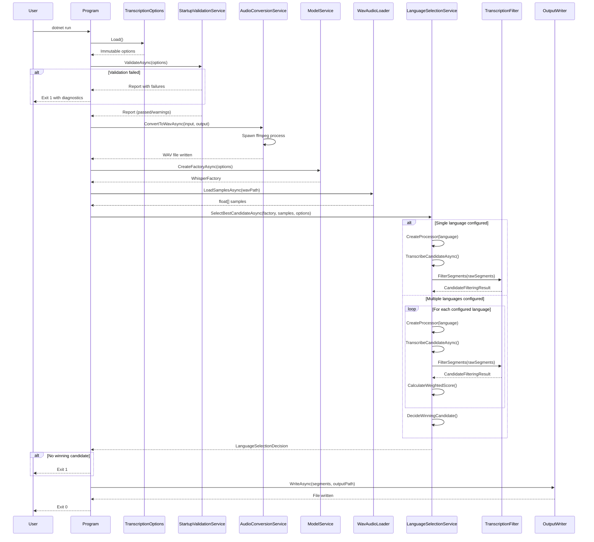
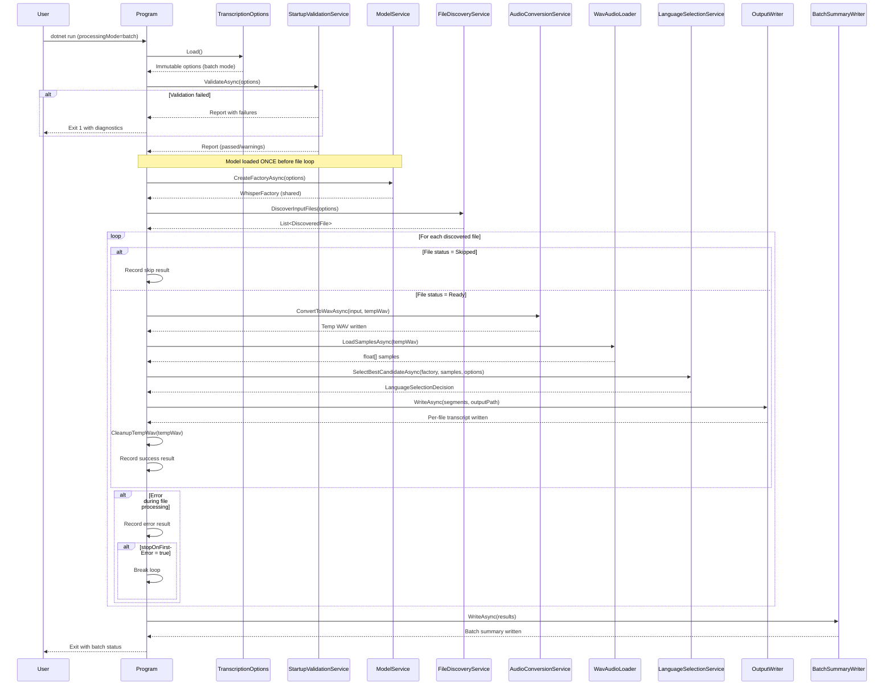
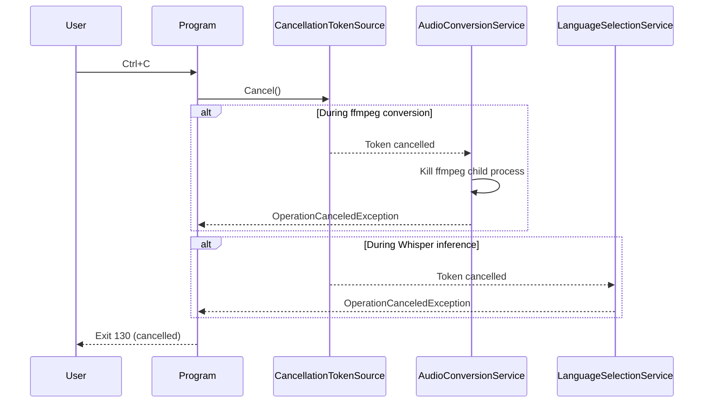

# Runtime Sequences

> How the application behaves at runtime — sequence diagrams for both processing modes.

## Single-File Mode

## Batch Mode

## Cancellation Flow

## Key Observations

**Model reuse in batch mode.** The Whisper model is loaded once before the file loop begins. This is a deliberate choice (ADR-010, ADR-011) — loading a GGML model is expensive, and native runtime teardown on macOS has shown instability. Sharing the factory across files trades theoretical resource isolation for practical stability.

**Sequential file processing.** Files are processed one at a time within the loop. There is no parallelism. This keeps memory usage predictable, avoids native runtime contention, and simplifies error isolation (see ADR-011).

**Error isolation.** Each file in the batch loop has its own try/catch. A failure in one file records the error and continues to the next (unless `stopOnFirstError` is configured). The summary report at the end provides a clear picture of what succeeded and what failed.

**Temp WAV cleanup.** Intermediate WAV files are deleted after each file completes processing. This bounds disk usage during long batch runs. The `keepIntermediateFiles` option exists for debugging.
