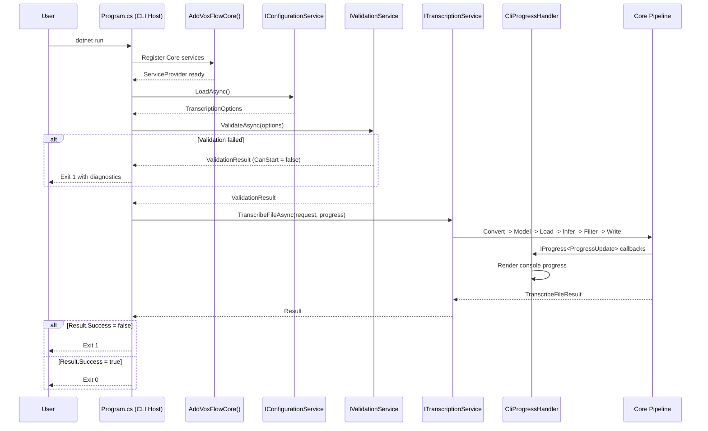
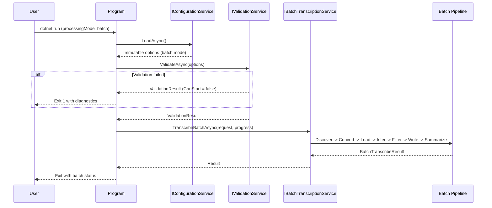
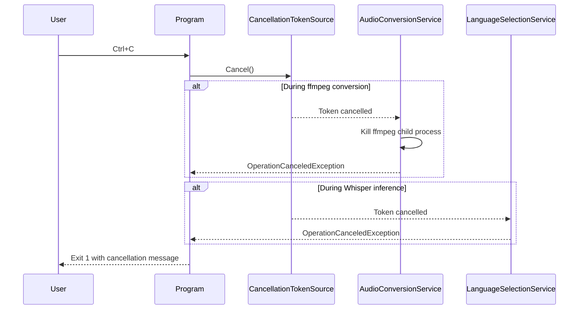
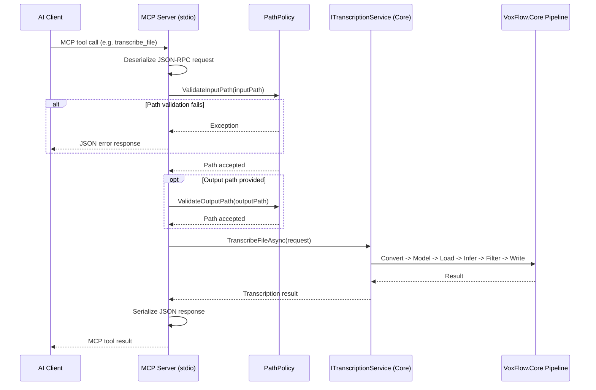
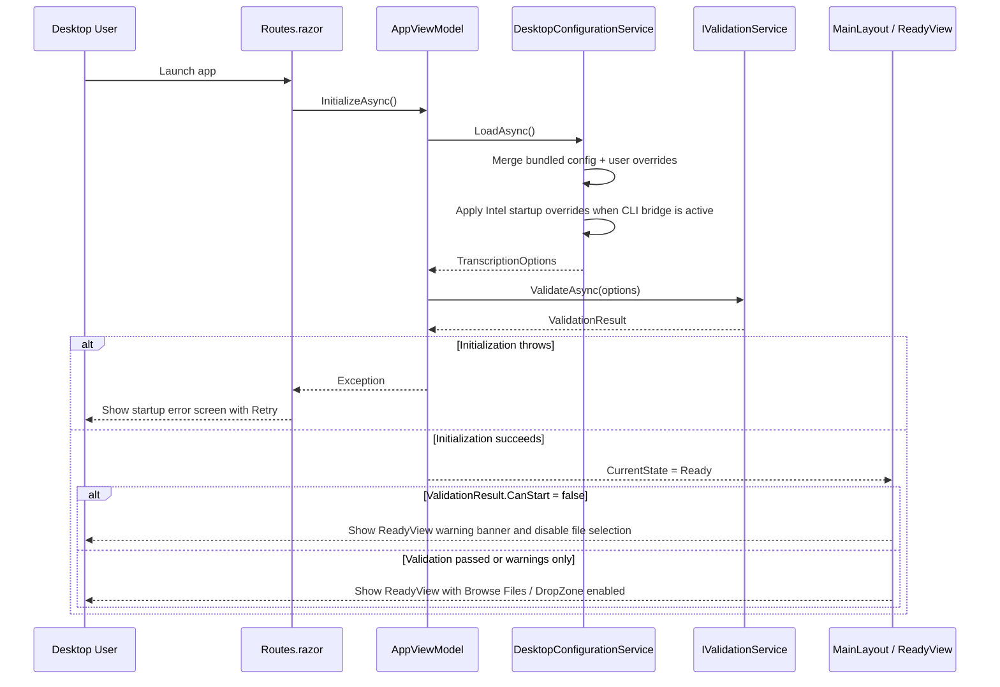
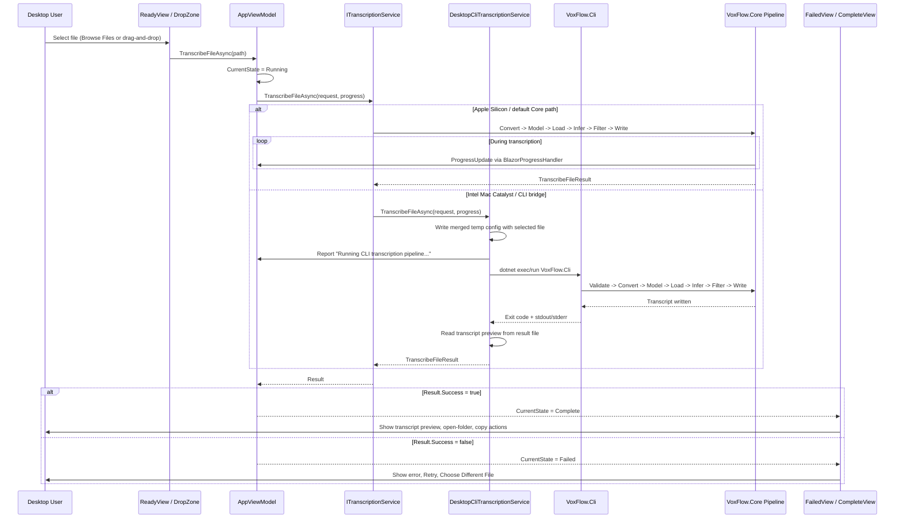

# Runtime Sequences

> How the application behaves at runtime across the supported hosts.

## Single-File Mode (CLI)

## Batch Mode (CLI)

## Cancellation Flow

## MCP Server — Tool Invocation

## Desktop — Startup and Validation

## Desktop — Single-File Transcription

## Key Observations

**Model reuse in batch mode.** The Whisper model is loaded once before the batch loop begins. This reduces reload cost and avoids unnecessary native-runtime churn.

**Sequential file processing.** Batch mode stays single-threaded. This keeps memory usage predictable and avoids uncertain native-runtime concurrency behavior.

**Desktop state flow is explicit.** The Desktop UI is driven by `AppState` (`Ready`, `Running`, `Failed`, `Complete`) rather than router-style page navigation. `Routes.razor` exists only for startup initialization and retry.

**Desktop config merge is host-specific.** Desktop does not rely on `TRANSCRIPTION_SETTINGS_PATH` by default. It builds a merged runtime config from bundled defaults plus `~/Library/Application Support/VoxFlow/appsettings.json`.

**Intel Mac Catalyst uses the CLI bridge.** Desktop replaces the default `ITranscriptionService` with `DesktopCliTranscriptionService` on Intel Mac Catalyst. The workaround stays local and reuses the current CLI pipeline rather than forking Core logic. The bridge communicates progress via structured JSON lines on stderr (enabled by setting `VOXFLOW_PROGRESS_STREAM=1`), parsed by `DesktopCliSupport.TryParseProgressUpdate()`.

**Desktop startup validation is non-blocking at the route level.** Validation failures do not crash the shell. Instead, the app stays on `ReadyView`, surfaces the failed checks, and disables file selection until the configuration is fixed.

**Desktop integrated browse flow is green.** The real UI automation suite now covers app launch, `Browse Files`, the running state, and completion against the actual `.app`.

**MCP stdout protection remains critical.** The MCP host keeps stdout reserved for JSON-RPC traffic and sends diagnostics to stderr.
