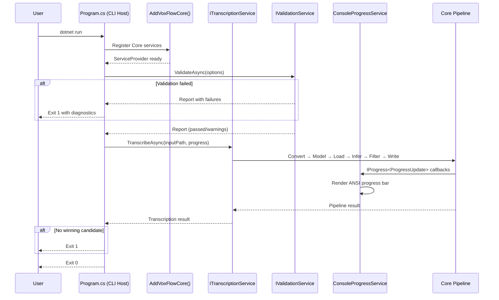
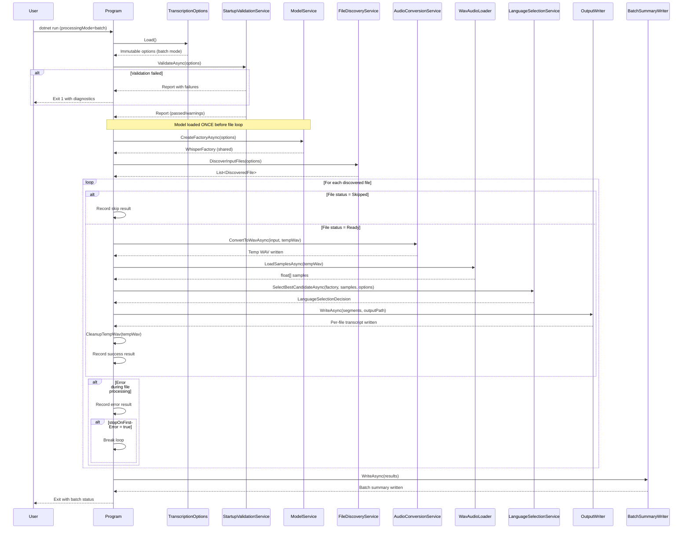
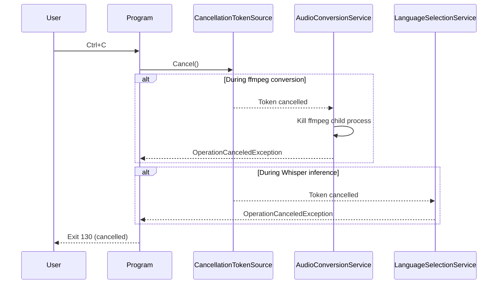
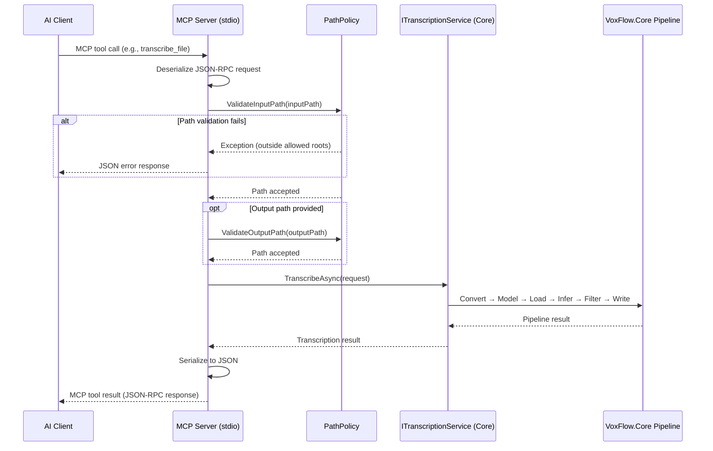
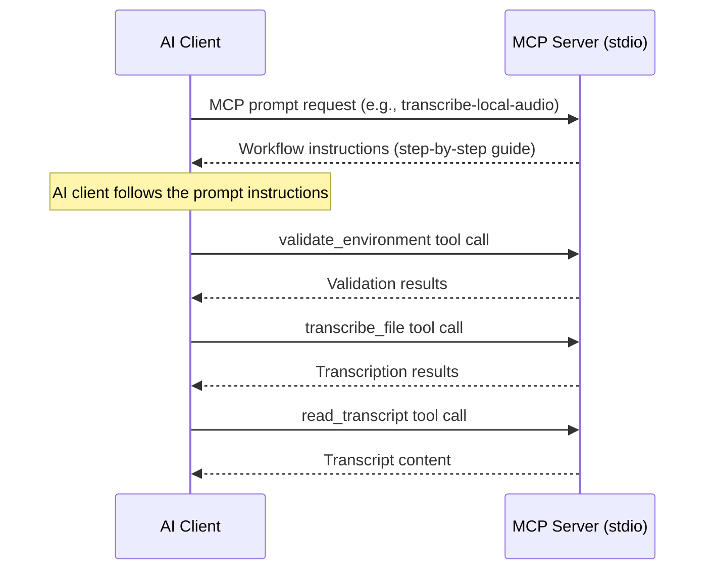
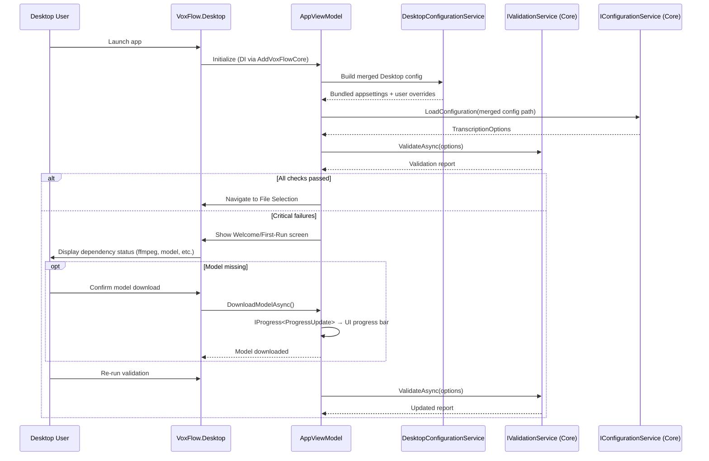
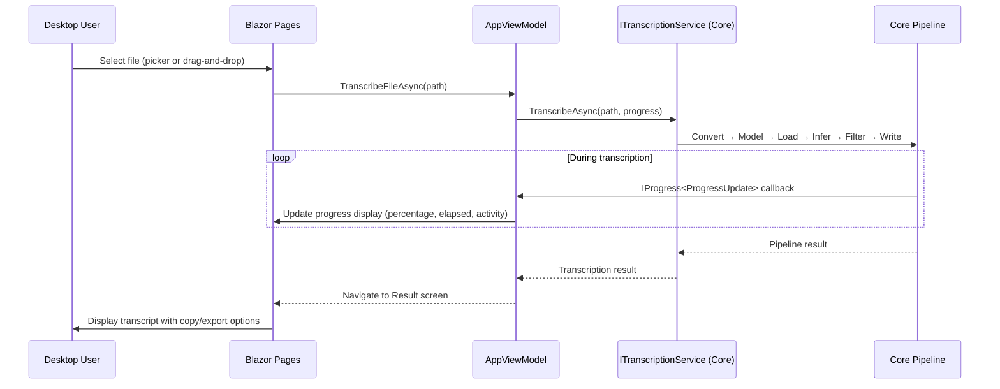

# Runtime Sequences

> How the application behaves at runtime — sequence diagrams for both processing modes.

## Single-File Mode (CLI)

## Batch Mode

## Cancellation Flow

## MCP Server — Tool Invocation

## MCP Server — Prompt-Guided Workflow

## Desktop — First-Run Validation

## Desktop — Single-File Transcription

## Key Observations

**Model reuse in batch mode.** The Whisper model is loaded once before the file loop begins. This is a deliberate choice (ADR-010, ADR-011) — loading a GGML model is expensive, and native runtime teardown on macOS has shown instability. Sharing the factory across files trades theoretical resource isolation for practical stability.

**Sequential file processing.** Files are processed one at a time within the loop. There is no parallelism. This keeps memory usage predictable, avoids native runtime contention, and simplifies error isolation (see ADR-011).

**Error isolation.** Each file in the batch loop has its own try/catch. A failure in one file records the error and continues to the next (unless `stopOnFirstError` is configured). The summary report at the end provides a clear picture of what succeeded and what failed.

**Temp WAV cleanup.** Intermediate WAV files are deleted after each file completes processing. This bounds disk usage during long batch runs. The `keepIntermediateFiles` option exists for debugging.

**MCP stdout protection.** The MCP server redirects `Console.SetOut(Console.Error)` at startup. This ensures that any diagnostic writes from VoxFlow services go to stderr, keeping the stdout channel clean for MCP JSON-RPC protocol frames.

**MCP path validation.** Every file path from an MCP tool argument passes through `PathPolicy` before reaching the Core service interfaces. This is a hard security boundary — paths outside configured allowed roots are rejected with an error response, never reaching the file system.

**Desktop contextual flow.** The Desktop app uses a contextual navigation model where the current Blazor page represents the application state. There is no separate state machine — navigating to a page IS transitioning to that state. This simplifies the mental model and keeps the UI code straightforward.

**Desktop config merge.** The Desktop host does not rely on `TRANSCRIPTION_SETTINGS_PATH` by default. It builds a merged runtime config from bundled app resources plus `~/Library/Application Support/VoxFlow/appsettings.json`, then hands that resolved file to Core configuration loading.

**Desktop flow verification status.** The sequence above is the intended workflow. Current headless UI tests verify the direct `ReadyView -> DropZone -> AppViewModel -> ITranscriptionService` path with real audio inputs (`artifacts/Input/Test 1.m4a` and `artifacts/Input/Test 2.m4a`), but the fully integrated `Routes` shell still has open `Browse Files` failures and remains under stabilization.

**Host-agnostic progress.** Core services report progress via `IProgress<ProgressUpdate>`. The CLI host renders this as an ANSI progress bar, the Desktop host renders it as a Blazor UI update, and the MCP server suppresses it. This decoupling means Core services have no knowledge of how progress is displayed.
